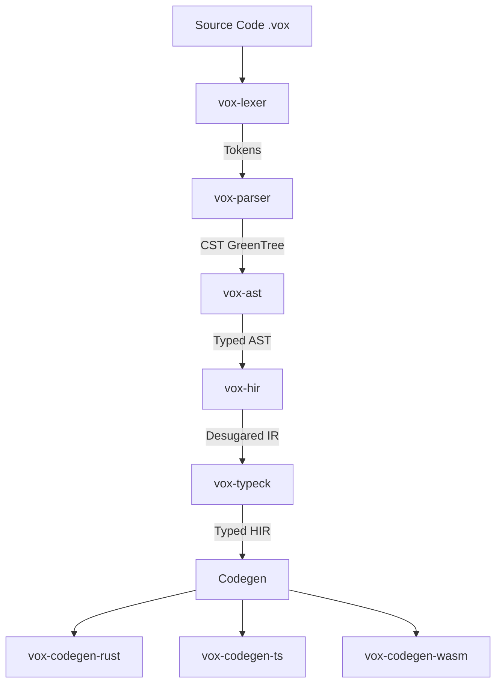

# Vox Architecture & Agent Guide

> [!IMPORTANT]
> This document serves as the **Single Source of Truth** for the Vox programming language architecture, roadmap, and development patterns. All future development, whether by human or AI agents, must align with the principles and structures defined here.

## 1. Core Philosophy

**Vox** is an AI-native, full-stack programming language designed to bridge the gap between high-level intent and low-level performance.

### Key Tenets
1.  **Uniformity**: One language for the entire stack (Frontend + Backend + Infrastructure).
2.  **Durability**: Execution should survive failures. Workflows and Actors are first-class primitives.
3.  **Distribution**: The runtime is inherently distributed. Location transparency is the default.
4.  **AI-Native**: The syntax and semantics are designed to be easily generated and reasoned about by LLMs.
5.  **Performance**: Compiles to native code (Rust) and optimized WASM/JS, not an interpreted runtime.
6.  **ZERO Null States**: The presence of `null` severely breaks AI generative capabilities, leads to fatal NPE logic flaws, and produces ambiguous reasoning gaps. All states must strictly utilize `Option[T]` (lowering to TS `undefined`), `Result`, strict structurally-typed Discriminated Unions, or definitive error types. `null` is permanently banned from generation logic and the Vox ecosystem payload lifecycle.

## 2. Architecture

The Vox compiler follows a modern, modular pipeline architecture.

### 2.1 Compiler Pipeline (`crates/`)



-   **Lexer (`vox-lexer`)**: Uses `logos` for high-performance tokenization.
-   **Parser (`vox-parser`)**: A recursive descent parser that produces a Rowan-based GreenTree (lossless syntax tree). resilient to errors for LSP support.
-   **AST (`vox-ast`)**: Strongly typed wrappers around the untyped CST.
-   **HIR (`vox-hir`)**: High-Level Intermediate Representation. Desugars syntax sugar and performs name resolution.
-   **TypeCheck (`vox-typeck`)**: Bidirectional type checking with unification-based inference. Handles generic ADTs and effect systems.
-   **CodeGen**:
    -   `vox-codegen-rust`: Emits Rust code using `quote!`.
    -   `vox-codegen-ts`: Emits TypeScript definitions and runtime code.

### 2.2 Runtime (`crates/vox-runtime`)

The runtime is built on top of **Tokio** and **Axum**.

-   **Actor System**: Every `@component` and `actor` is an isolated entity with a mailbox.
-   **Workflows**: Durable execution state machines (future).
-   **Networking**: Automatic serialization/deserialization via Serde/Bincode over HTTP/WebSocket.

### 2.3 Directory Structure

| Path | Description |
| :--- | :--- |
| `crates/vox-cli` | The `vox` command-line tool entry point. |
| `crates/vox-lsp` | Language Server Protocol implementation. |
| `crates/vox-std` | Standard library (future). |
| `examples/` | Reference implementations (e.g., `chatbot.vox`). |

## 3. Roadmap

### Phase 1: Foundation (Completed)
- [x] Basic Lexer/Parser with error recovery.
- [x] Initial CLI (`vox build`, `vox bundle`).
- [x] Rust Backend generation (Axum).
- [x] TypeScript Frontend generation (React/Fetch).

### Phase 2: Core Language Features (In Progress)
- [x] **ADTs & Pattern Matching**: `type Option[T] = Some(T) | None`
- [x] **Type Inference**: Local variable inference.
- [ ] **Traits/Interfaces**: Ad-hoc polymorphism.
- [ ] **Generics**: Full support in functions and structs.

### Phase 3: Ecosystem & Tooling (Current Focus)
- [x] **LSP**: Syntax highlighting, diagnostics using `tower-lsp`.
- [x] **Formatter**: `vox fmt` integrated utilizing a Lexical span formatter preserving inline indentation logic perfectly.
- [x] **Package Manager**: `vox install` integrated over `vox-pm` SQL CAS backend logic!

### Phase 4: Advanced Features (Future)
- [ ] **WASM Target**: Compile Vox actors directly to WASM modules.
- [ ] **Durable Objects**: Database-backed actor state.
- [ ] **v0.dev Integration**: AI-generated UI components directly from Vox signatures.

## 4. Development Guide

### Building
```bash
cargo build --workspace
```

### Testing
Run the full test suite, including integration tests:
```bash
cargo test --workspace
```

### Adding a Language Feature
1.  **Grammar**: Update `crates/vox-parser/src/grammar.rs`.
2.  **AST**: Add node wrappers in `crates/vox-ast`.
3.  **Lowering**: Map AST to HIR in `crates/vox-hir`.
4.  **Type Checking**: Add inference rules in `crates/vox-typeck`.
5.  **Codegen**: Implement emission in `vox-codegen-rust` and `vox-codegen-ts`.

## 5. Contribution Guidelines

-   **Tests**: Every new feature must include a UI test in `tests/` or a unit test.
-   **Errors**: Use `miette` for user-facing errors.
-   **Style**: Follow standard Rust formatting (`cargo fmt`).

---
*Generated: 2026-02-17*
