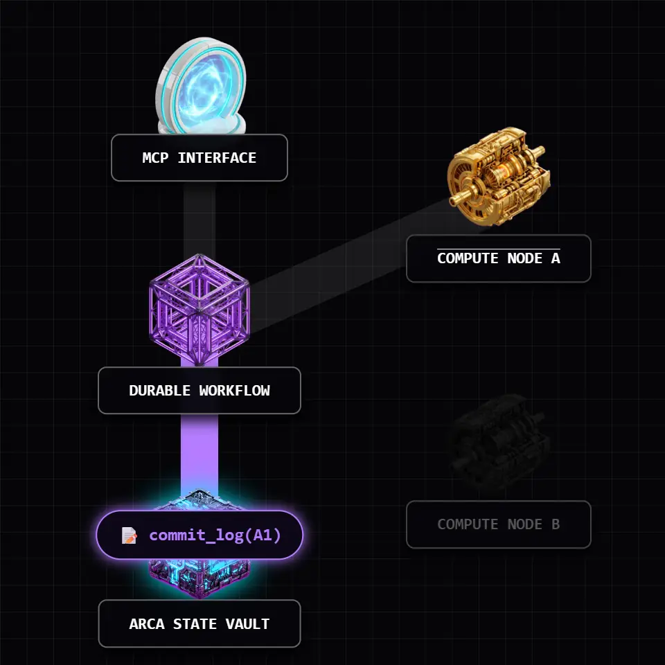

<div align="center">
  

  <br><br>

  <p><strong>One <code>.vox</code> file compiles to a database schema, a typed server, a browser app, and the artifacts to deploy them.</strong> Initiated by Bertrand Reyna-Brainerd.</p>

  <p><a href="https://voxlang.org"><strong>voxlang.org</strong></a></p>
</div>

<p align="center">
  <a href="https://voxlang.org"></a>
  <a href="https://github.com/vox-foundation/vox/commits/main"></a>
  <a href="LICENSE"></a>
  <a href="https://voxlang.org/feed.xml"></a>
</p>

---

<!-- Code examples in this file mirror examples/golden/*.vox -->
<!-- Run: vox check examples/golden/*.vox to verify -->

<div align="center">
  <blockquote>
    <p><em>"Is it a fact — or have I dreamt it — that, by means of electricity, the world of matter has become a great nerve, vibrating thousands of miles in a breathless point of time? Rather, the round globe is a vast head, a brain, instinct with intelligence!"</em></p>
    <p>— Nathaniel Hawthorne, <em>The House of the Seven Gables</em> (1851)</p>
  </blockquote>
</div>

---

<!-- ANCHOR: why_vox -->
## Why Vox

Mainstream languages predate LLMs by decades. They tolerate implicit state — nulls, exceptions, schemas restated three times across the stack. That's tractable for a person; it's a minefield for a statistical code generator. A million-token context window doesn't help when most of it is integration boilerplate.

<div align="center">
  
  <p>
    <strong>Fragmentation in Traditional Web Development</strong><br>
    Traditional development requires restating data models and logic across frontend, API, backend, and database layers. This duplication creates significant maintenance overhead and increases the risk of integration drift.
  </p>
</div>

Vox is what falls out when you design the language *after* the model: collapse the duplications, push errors into the type system, draw the browser/server boundary in one place, and build durability and tool exposure into the grammar instead of layering them on top.
<!-- ANCHOR_END: why_vox -->

## Killer Features

Vox collapses the massive fragmentation of modern web and AI development into a single, cohesive ecosystem.

- **[Local AI Inference & Fine-Tuning](crates/vox-ml-cli/)**: Run models natively on your GPU without touching Python. Execute open-weights models or train them via QLoRA using Rust-native acceleration (CUDA and Apple Metal).
- **[One File to Rule the Stack](docs/src/reference/deployment-compose.md)**: A single `.vox` file emits database migrations, a typed API server, reactive frontend components, and deployment artifacts. Zero integration boilerplate.
- **[Distributed Mesh Computing](docs/src/how-to/how-to-model-routing.md)**: Securely network laptops and cloud servers. The orchestrator automatically routes AI workloads to the nodes with the best available hardware.
- **[Native Desktop GUI](crates/vox-gui/)**: Compile `.vox` files into fully native, cross-platform graphical applications powered by Tauri, complete with native IPC bridges.
- [Wire format](crates/vox-protocol/) — Data and tool contracts are the single source of truth; schemas are generated, not restated.
- [Autonomous RAG & Research](docs/src/reference/socrates-protocol.md) — Deploy agents equipped with persistent long-term memory, fact-checking (the [Socrates protocol](docs/src/reference/socrates-protocol.md)), and autonomous web-search.

---

## Install

Vox is currently in pre-1.0 active development. Official installation packages (`voxup`, `.msi`, `.deb`, Homebrew) are configured in the CI pipeline but have not yet been formally released. 

### Building from Source
**Prerequisites:** Ensure you have [Rust and Cargo](https://rustup.rs/) installed.

```bash
git clone https://github.com/vox-foundation/vox.git
cd vox
cargo install --path crates/vox-cli
```

### Quick Start
```bash
vox init my-app
cd my-app
vox run src/main.vox
```

## The CLI

The full CLI surface, including every `vox ci`, `vox populi`, and `vox mens` subcommand, lives at [`docs/src/reference/cli.md`](docs/src/reference/cli.md). Run `vox commands --recommended` for first-time discovery.

---

### Ecosystem & Plugins

Vox is highly modular. The core binary covers compile, run, bundle, and package; heavier capabilities are provided through optional extensions.

#### CLI Extensions
Extensions ship as separate binaries; `vox` will notify you if one is required but missing.

| Extension | Adds | Purpose |
|---|---|---|
| `vox-ml-cli` | `vox mens`, `vox populi`, ... | Rust-native ML (Candle, Whisper) for training and serving. |
| `vox-schola` | `vox schola`, `vox scientia` | Autonomous research and fact-checking. |
| `vox-gui` | `vox gui` | Native Tauri desktop application environment. |

#### Agent Skills
The Vox AgentOS dynamically loads capabilities (Skills) through a stable ABI. First-party skills include:

- **ML & Audio**: `mens-candle-cuda`, `mens-candle-metal`, `oratio-mic`, `populi-mesh`
- **Execution**: `runtime-container` (Docker), `runtime-wasm`, `script-execution`
- **Agent Skills**: `skill-git`, `skill-memory`, `skill-orchestrator`, `skill-rag`, `skill-testing`
- **Infrastructure**: `api`, `cloud`, `host`, `types`, `webhook`

*→ See the [Plugin Catalog](docs/src/reference/plugin-catalog.generated.md) for detailed signatures.*

<!-- ANCHOR: how_vox -->
## How Vox works

<div align="center">
  
  <p>
    <strong>Unified Compilation from a Single Source</strong><br>
    Vox uses a single .vox file to derive the entire technology stack. The compiler uses this unified source of truth to generate synchronized database schemas, API servers, and reactive UI components simultaneously.
  </p>
</div>

### Pillar 1: One source of truth

```vox
@table type Task {
    title: str
    done:  bool
    owner: str
}
```

The declaration is the [schema](crates/vox-db/), the [wire format](crates/vox-protocol/), and the typed client. `@index Task.by_owner on (owner)` lives next to it. [Migrations](crates/vox-db/) come from the diff against the previous schema.

→ [`@table` reference](docs/src/reference/ref-decorators.md) · [migration guide](docs/src/how-to/how-to-database.md)

### Pillar 2: Errors in the type system

```vox
@query
fn recent_tasks() to list[Task] {
    return db.Task.where({ done: false }).limit(10)
}

@mutation
fn add_task(title: str, owner: str) to Result[Id[Task]] {
    if title is "" {
        return Error("title required")
    }

    return Ok(db.insert(Task, {
        title: title,
        done: false,
        owner: owner
    }))
}
```

A `Result[T]` caller must handle both arms — no exceptions, no `null`, no implicit propagation. The compiler refuses to build code that drops `Error`. [`vox-lsp`](crates/vox-lsp/) surfaces the same diagnostics live in the editor.

`@query`, `@mutation`, and `@server` are the three endpoint kinds. They replace the previous `@endpoint(kind: …)` form (deprecated 2026-05-23; auto-migrated by `vox fmt`).

→ [decorator reference](docs/src/reference/ref-decorators.md)

### Pillar 3: One file → running deployment

```vox
component TaskPage(tasks: list[Task]) {
    view: column() {
        tasks.map(fn(t) { 
            row() { 
                text() { t.title } 
            } 
        })
    }
}

routes { 
    "/" to TaskPage 
}
```

`vox build` emits [React](https://react.dev/)/[TSX](https://www.typescriptlang.org/) components, a generated `vox-client.ts` RPC bridge, and — via [`vox-deploy-codegen`](crates/vox-deploy-codegen/) — Dockerfile, Compose, Kubernetes, Fly, Coolify, and systemd targets, all derived from the same module graph. External React, TanStack, or mobile apps can import the emitted components or call the endpoints over the bridge.

→ [external interop plan](docs/src/architecture/external-frontend-interop-plan-2026.md) · [deployment](docs/src/reference/deployment-compose.md)

### Pillar 4: Agents, MCP, and the orchestrator

`@mcp.tool` and `@mcp.resource` expose typed functions to any [Model Context Protocol](https://modelcontextprotocol.io) client.<sup>[3](#ref3)</sup> The tool description, parameter schema, and return type are all derived from the function signature.

```vox
@mcp.tool "Process a checkout for the given amount"
fn checkout(amount: int) to Result[str] {
    if amount > 1000 {
        return Error("amount too large")
    }
    return Ok("tx_123")
}

@mcp.resource("vox://orders/recent", "Recent orders this hour")
fn recent_orders() to list[Order] {
    return db.Order.where({ created_at: hour_ago() })
}
```

[`vox-orchestrator`](crates/vox-orchestrator/) routes work to agents by file affinity and ten policy modules (tier cascade, plan-mode trigger, risk matrix, budget gate, circuit breaker, calibration, …). Capabilities are extensible: dozens of first-party plugins (compiler, git, memory, RAG, testing, Mens-Candle-CUDA/Metal, WASM and OCI runtimes) load through [`vox-plugin-host`](crates/vox-plugin-host/) behind a stable ABI.

<div align="center">
  
  <div style="max-width: 600px; text-align: left; margin-top: 15px;">
    <h3>Durable execution</h3>
    <p>
      <code>workflow</code> and <code>activity</code> are keywords, not a library. The runtime in <a href="crates/vox-workflow-runtime/"><code>vox-workflow-runtime</code></a> checkpoints every <code>activity</code> result to a per-run journal (<a href="docs/src/adr/019-durable-workflow-journal-contract-v1.md">ADR-019, v1 contract</a>). A crash mid-run resumes on restart with the completed activities replayed from the journal; only the remaining steps re-execute. <code>@scheduled</code> functions run on a persistent scheduler loop with crash-safe state. Supported subset documented in <a href="docs/src/adr/021-generated-workflow-durability-parity.md">ADR-021</a>; completion ADR is <a href="docs/src/adr/041-durable-functions-completion-2026.md">ADR-041</a>. The supported subset ships today; unrestricted control-flow replay remains future work.<sup><a href="#ref1">1</a>, <a href="#ref2">2</a></sup>
    </p>
  </div>
</div>

→ [orchestration policy research](docs/src/architecture/autonomous-orchestration-policy-research-2026.md) · [`vox-skills`](crates/vox-skills/) · [ADR-041: durable functions completion](docs/src/adr/041-durable-functions-completion-2026.md)

### Pillar 5: Built for LLM authorship

The shape of the four pillars above is downstream of one decision: *design the language after the model*. Three subsystems make that concrete.

- **Grammar-constrained decoding.** [`vox-constrained-gen`](crates/vox-constrained-gen/) is an Earley/PDA decoder<sup>[5](#ref5)</sup> with a deadlock watchdog. Token-stream constraint, not post-hoc validation — invalid Vox cannot be sampled.
- **Measurable detectors.** Rules live in [`rules.v1.yaml`](crates/vox-rule-pack/rules/rules.v1.yaml) with a JSON Schema and an [F1 bench scorer](https://en.wikipedia.org/wiki/F-score) over fixture corpora. Stub, hollow-fn, victory-claim, AI-laziness, secret, magic-value, deprecated-symbol, and effect-system rules are all scored against ground truth, not vibes.
- **Local training.** Vox is new; mainstream languages saturate the public training corpus, Vox doesn't. `vox populi` runs QLoRA<sup>[4](#ref4)</sup> fine-tunes and OpenAI-compatible serving on detected CUDA / Metal / WebGPU — [Burn](https://github.com/tracel-ai/burn) + [Candle](https://github.com/huggingface/candle), no Python. Requires the `gpu` cargo feature.

→ [`examples/golden/`](examples/golden/) · [Rosetta comparison](docs/src/explanation/expl-rosetta-inventory.md) · [why Vox for AI](docs/src/explanation/why-vox-for-ai.md)

---

### Touches you'll see everywhere

A few language-level decisions show up in almost every snippet:

**Phonetic operators.** Vox spells comparisons and booleans as words: `is`, `isnt`, `and`, `or`, `not`. The bare `!=` form parses, but the lexer emits a diagnostic pointing at `isnt`. Words appear in language-model training data far more often than punctuation patterns — so a model is more likely to predict the word than the symbol, and a human reads it aloud unambiguously.

```vox
fn classify(score: int, override: bool) to str {
    if override is true { return "admin" }
    if score >= 90 and score isnt 100 { return "expert" }
    if score < 50 or not is_calibrated() { return "novice" }
    return "regular"
}
```

**Opaque ID types.** `Id[User]` and `Id[Post]` are distinct types. Passing the wrong-table ID to `db.Post.find(user_id)` is a compile error, not a 4 AM runtime crash.

**`?` propagation + `match` exhaustiveness.** The `?` postfix unwraps `Ok(value)` or short-circuits the function with the `Error`. The only way to consume a `Result` is `match`, and `match` arms must cover both `Ok` and `Error` — the compiler refuses to build silent error-swallowing code.

**Sandboxed execution tiers.** `vox run --isolation wasm script.vox` runs untrusted scripts under [Wasmtime](https://wasmtime.dev/) ([`vox-wasm-engine`](crates/vox-wasm-engine/)). `--isolation container` runs them in an OCI sandbox via [`vox-container`](crates/vox-container/). [`vox-bounded-fs`](crates/vox-bounded-fs/) caps reads by size; [`vox-exec-grammar`](crates/vox-exec-grammar/) classifies shell-out risk before execution. Useful when an agent generates code you don't want to run on the host.

**`vox audit`** runs the [rule pack](crates/vox-rule-pack/rules/rules.v1.yaml) — stub, hollow-fn, victory-claim, AI-laziness, secret, magic-value, deprecated-symbol, and effect-system detectors — each [F1-scored](https://en.wikipedia.org/wiki/F-score) against fixture corpora. Rules are calibrated, not vibes.

---

### Engineering invariants

Properties enforced on the project itself, invisible from the language surface:

- **Layered crate graph.** All 101 workspace crates declare a layer (L0 pure types → L5 surfaces) in [`layers.toml`](docs/src/architecture/layers.toml). [`vox-arch-check`](crates/vox-arch-check/) blocks inversions, fan-in violations, LoC budget overruns, and orphaned modules.
- **Sandboxed execution.** [`vox-wasm-engine`](crates/vox-wasm-engine/) ([Wasmtime](https://wasmtime.dev/)), [`vox-container`](crates/vox-container/) ([OCI](https://opencontainers.org/)), [`vox-bounded-fs`](crates/vox-bounded-fs/) (size-capped reads), [`vox-exec-grammar`](crates/vox-exec-grammar/) (shell risk classifier). Tiers are selectable on `vox run`.
- **Declared capabilities.** [`vox-capability-registry`](crates/vox-capability-registry/) gates what tools can do; [`vox-identity`](crates/vox-identity/) signs with [ed25519](https://en.wikipedia.org/wiki/EdDSA#Ed25519) against a trust ledger; [`vox-secrets`](crates/vox-secrets/) is the only path to a secret value.
<!-- ANCHOR_END: how_vox -->

---

## Automation: VoxScript-first

Project automation is `.vox`, not `.ps1`, `.sh`, or `.py`. Vox scripts are type-checked, cross-platform, and telemetry-observable by default.

```bash
vox run scripts/clean-cache.vox
vox run --isolation wasm scripts/process-untrusted-data.vox
```

**Key Commands:**
- `vox share publish` — Create a short-lived public tunnel for local previews.
- `vox audit` — Run the rule-pack against your codebase.
- `vox telemetry doctor` — Verify sink health and event wiring.

---

## Distributed AgentOS (Mesh)

Cross-machine orchestration is opt-in. Nodes advertise hardware capabilities (CUDA/Metal/VRAM) on startup, and the orchestrator automatically routes workloads to the best-equipped peer. Agent-to-agent communication is type-safe; wire mismatches are caught at compile time.

```bash
VOX_MESH_ENABLED=1 VOX_MESH_NODE_ID=my-node vox populi serve
vox populi status --quotas
```

Local models and cloud providers are managed through a unified policy layer with per-node quotas. See the [model routing how-to](docs/src/how-to/how-to-model-routing.md).

---

## Stability & Path to 1.0

<!-- ANCHOR: tier_table -->
Vox is marching toward a production-hardened v1.0 release. Surfaces are graded by their architectural stability and proximity to the v1 criteria.

| Feature Area | Status | Context & Maturity |
|:---|:---|:---|
| **Core Intelligence** | | |
| Orchestrator Core | 🔵 Stable | Thread-safe dispatch, agent lifecycle, and [Superpowers](docs/src/architecture/superpowers-ssot.md) orchestration. |
| Agent Skills (MCP) | 🟣 Mature | Full [MCP v1.0](https://modelcontextprotocol.io) compliance with 100+ first-party tools. |
| Socrates Research | 🟡 Preview | [Socrates protocol](docs/src/reference/socrates-protocol.md) for automated fact-checking and retrieval. |
| **Language Platform** | | |
| Compiler Core | 🟣 Mature | Wave 2 complete: pure-HIR lowering and stable syntax grammar. |
| LSP & IDE Tools | 🟣 Mature | Production-grade `vox-lsp` with full cross-reference support. |
| Durable Runtime | 🔵 Stable (interpreter) / 🟡 Preview (codegen) | Interpreter path: journal-backed replay for the supported subset ([ADR-019](docs/src/adr/019-durable-workflow-journal-contract-v1.md) / [ADR-021](docs/src/adr/021-generated-workflow-durability-parity.md)) ships; `@scheduled` runs on a persistent scheduler with crash-safe state. Codegen path: generated binaries link but `current_hir_module()` registration in emitted `main()` is a tracked Phase-5 follow-up — see [ADR-041](docs/src/adr/041-durable-functions-completion-2026.md). Unrestricted control-flow replay is explicit non-goal. |
| **Data & Foundation** | | |
| Database Engine | 🔵 Stable | [vox-db](crates/vox-db/) with Turso integration and zero-downtime migrations. |
| Secrets & Safety | 🔵 Stable | [Clavis](crates/vox-secrets/) hardened vault and [Rule Pack](crates/vox-rule-pack/) CI guards. |
| Telemetry Facade | 🟣 Mature | Unified [vox-telemetry](crates/vox-telemetry/) with trace propagation and cost rollups. |
| **AI/ML Engine** | | |
| Inference (Mens) | 🟡 Preview | Native CUDA/Metal/CPU inference with [Candle/Burn](crates/vox-inference/). |
| Training (Populi) | 🟠 Emergent | QLoRA native pipeline; loss-parity verification in progress. |
| Visus (Vision) | 🟠 Emergent | [Voice of Vision](crates/vox-cli/src/commands/visus/) for automated GUI bug detection. |
| **Platform & UI** | | |
| CLI & DX | 🟣 Mature | Rich diagnostic surface (`vox audit`, `vox ci`, `vox drift-check`). |
| Native GUI (Tauri) | 🟡 Preview | Tauri 2.0 integration with Dashboard, Agent Flow, and Superpowers catalog. |
| Distributed Mesh | 🟠 Emergent | Node discovery and workload routing functional across peers. |

**Stability Tiers:**
- 🟢 **Production Candidate**: Hardened for 1.0; feature-complete and regression-free.
- 🔵 **Stable**: API locked; high test coverage; used in core production internal loops.
- 🟣 **Mature**: Core logic stable; focus on ergonomics, documentation, and performance.
- 🟡 **Preview**: Feature-complete; API may shift based on early adopter feedback.
- 🟠 **Emergent**: Core logic functional; major feature parity or scaling remaining.
- 🚧 **Experimental**: Proof of concept; breaking changes are frequent and expected.
- 🔬 **Research**: Internal prototypes; not yet exposed in the standard CLI surface.

v1.0 criteria: [`docs/src/architecture/v1-release-criteria.md`](docs/src/architecture/v1-release-criteria.md). Roadmap: [GUI-native phases](docs/src/architecture/gui-native-roadmap-status-2026.md). History: [`CHANGELOG.md`](CHANGELOG.md).
<!-- ANCHOR_END: tier_table -->

Roadmap execution minimizes syntactic redundancy to stabilize the compiler primitives prior to v1.0. Retired symbols: [`AGENTS.md` retired-surfaces table](AGENTS.md).

---

## Documentation

Docs follow the **Diátaxis** framework.

| Intent | Start here |
|---|---|
| Learning | [Getting Started](docs/src/tutorials/tut-getting-started.md) · [First full-stack app](docs/src/tutorials/tut-first-app.md) |
| Task recipes | [How-To Guides](docs/src/how-to/) · [AI Agents & MCP](docs/src/how-to/how-to-ai-agents.md) |
| Understanding | [Why Vox for AI](docs/src/explanation/why-vox-for-ai.md) · [Compiler architecture](docs/src/explanation/expl-architecture.md) |
| Reference | [CLI](docs/src/reference/cli.md) · [Decorators](docs/src/reference/ref-decorators.md) |
| Architecture | [Master index](docs/src/architecture/architecture-index.md) · [Contributor hub](docs/src/contributors/contributor-hub.md) |
| Operations | [Deployment](docs/src/reference/deployment-compose.md) · [CI runner](docs/src/ci/runner-contract.md) |

---

## Contributing

Start at the [Contributor Hub](docs/src/contributors/contributor-hub.md). The [Contribution Loop](docs/src/contributors/contribution-loop.md) explains the write → verify → train cycle. If CI flags a gate failure, the [TOESTUB Guide](docs/src/contributors/toestub-contributor-guide.md) covers the common causes. Undocumented surfaces are tracked in [`DOC_GAPS.md`](docs/src/api/DOC_GAPS.md).

---

Beyond the rule pack, the CI environment enforces repo-wide invariants:

| Guard | Purpose |
|---|---|
| `vox arch-check` | Blocks layer inversions, fan-in violations, and LoC budget overruns. |
| `vox ci secret-env-guard` | Blocks raw `std::env` calls; enforces `vox-secrets` as the only secret source. |
| `vox ci sync-ignore-files` | Ensures `.voxignore` is synced to IDE-specific ignore files. |
| `vox-drift-check` | Detects semantic drift in multi-language workspace artifacts. |

Rationale and the full detector inventory live in [`AGENTS.md`](AGENTS.md).

---

<!-- ANCHOR: community_license -->
## Backing, license, contact

Funded via [Open Collective](https://opencollective.com/vox-foundation) — every transaction is public. Sponsorships fund developer grants, MENS training hardware, and academic bounties.

[Apache 2.0](https://www.apache.org/licenses/LICENSE-2.0): commercial use, patent grant, modification with attribution. [`LICENSE`](https://github.com/vox-foundation/vox/blob/main/LICENSE).

Discussion: [GitHub Discussions](https://github.com/vox-foundation/vox/discussions). Changelogs and ADRs: [RSS](https://voxlang.org/feed.xml).
<!-- ANCHOR_END: community_license -->

---

## References

<a id="ref1"></a>**[1]** Fateev, M., & Abbas, S. (2019). *Temporal*. Temporal Technologies. <https://temporal.io>

<a id="ref2"></a>**[2]** Armstrong, J. (2003). *Making reliable distributed systems in the presence of software errors* [Ph.D. thesis, Royal Institute of Technology, Stockholm]. <https://erlang.org/download/armstrong_thesis_2003.pdf>

<a id="ref3"></a>**[3]** Anthropic. (2024). *Model Context Protocol*. <https://modelcontextprotocol.io>

<a id="ref4"></a>**[4]** Dettmers, T., Pagnoni, A., Holtzman, A., & Zettlemoyer, L. (2023). *QLoRA: Efficient Finetuning of Quantized LLMs*. arXiv. <https://arxiv.org/abs/2305.14314>

<a id="ref5"></a>**[5]** Earley, J. (1970). *An efficient context-free parsing algorithm*. Communications of the ACM, 13(2), 94-102. <https://dl.acm.org/doi/10.1145/362007.362035>
