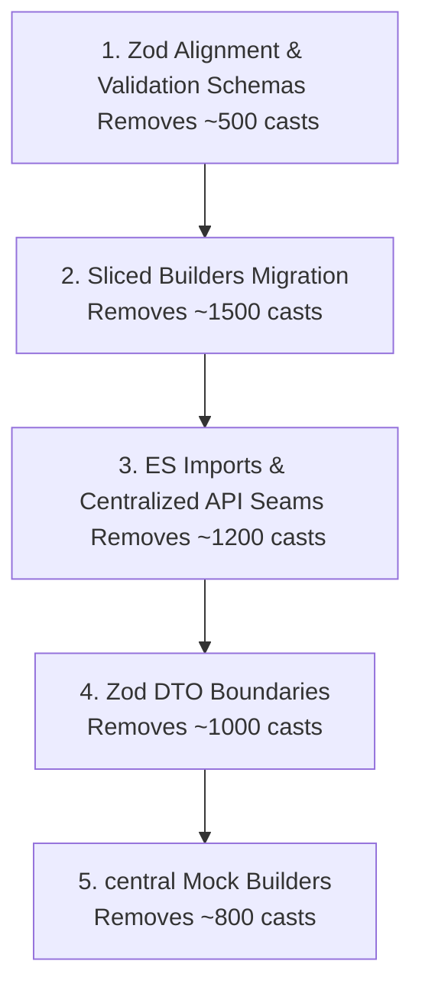

# FableForge "as any" Casts Reduction Strategy

Last modified: 2026-06-17T18:26:17-04:00

## Purpose

A systemic strategy for auditing, classifying, and eliminating the ~8,871 legacy `as any` casts across the FableForge monorepo. This document outlines how to safely replace these casts with strongly typed structures in logical batches, moving the codebase toward 100% strict type safety without introducing regressions or compiler recursion limits (TS2589).

---

## 📊 Current Cast Distribution Analysis

Based on an AST-based parser run over the active `no-any-baseline.json` (8,871 total casts), the casts fall into the following distinct categories:

| Category | Count | % | Primary Cause | Solution |
| :--- | :--- | :--- | :--- | :--- |
| **Other Convex Files** | ~3,258 | 39.7% | Untyped `ctx` operations, dynamic query index properties, database field reads. | Migrate to sliced builders (`sliceQuery`, `sliceMutation`, `sliceAction`). |
| **API Reference / Seams (T0)** | ~1,500 | 18.3% | Dynamic resolution of `api` or `internal` imports. | Use type-safe static ES imports with centralized mock fallbacks. |
| **Other Src (Frontend)** | ~876 | 10.7% | Untyped layout props, Clerk credentials, local storage keys. | Implement strict React prop interfaces and type-safe storage wrappers. |
| **Test Files & Mocks** | ~868 | 10.6% | Creating mock contexts (`ctx as any`) for database operations in Vitest. | Use centralized mock builders (`createMockQueryCtx`) or `convex-test`. |
| **Convex Registration (T0)** | ~657 | 8.0% | Registering raw mutations/queries that crash the compiler type recursion. | Wrap with sliced builders which automatically erase types *only* at the registration seam. |
| **Other Packages** | ~559 | 6.8% | Opaque variables inside shared packages (e.g. MUD, ffscript, combat). | Narrow types and interfaces at package boundaries. |
| **Other Scripts** | ~350 | 4.3% | Quick automation or database seeding scripts. | Define simple TypeScript interfaces for script-specific parameters. |
| **Run Call / Internal Mutation Calls** | ~142 | 1.7% | Dynamic invocation of `ctx.runMutation(internal.x.y as any)`. | Centralized schema lookup or typed internal calls. |

---

## 🛠️ The 5 Core Strategies to Remove Thousands of Casts

### 1. Convex Action and Mutation Slicing (Removes ~1,500+ casts)
* **The Problem:** Developers write `(ctx as any).runQuery(...)` or cast `ctx: any` because full context structures force the compiler to recursively instantiate the full `DataModel` (400+ tables), causing `TS2589` compiler depth errors.
* **The Cure:** Migrate files to use `sliceQuery`, `sliceMutation`, or `sliceAction` from `convex/lib/typedBuilders.ts`.
  ```typescript
  // BEFORE:
  export const myMutation = mutation({
    handler: async (ctx: any, args) => {
      const user = await (ctx as any).runQuery(internal.users.get, { id: args.userId });
    }
  });

  // AFTER:
  export const myMutation = sliceMutation<"users">()({
    handler: async (ctx, args) => {
      // ctx is automatically typed to only include the "users" table slice! No casts needed.
      const user = await ctx.runQuery(internal.users.get, { id: args.userId });
    }
  });
  ```

### 2. Centralized Seam Imports for Generated APIs (Removes ~1,200+ casts)
* **The Problem:** Large numbers of files use `const { internal } = require("../_generated/api") as any;` to bypass circular dependencies or mock-binding constraints.
* **The Cure:** Use type-safe static ES imports with sliced builders. The wrapper builders automatically handle dynamic module binding cast-erasure internally, removing the need for dynamic `require` and inline casts in business logic:
  ```typescript
  // BEFORE:
  const { internal } = require("../_generated/api") as any;
  const data = await (ctx as any).runQuery(internal.myQuery, { ... });

  // AFTER:
  import { internal } from "../_generated/api";
  const data = await ctx.runQuery(internal.myQuery, { ... });
  ```

### 3. Zod Version Alignment & Schema Exports (Removes ~500+ casts)
* **The Problem:** Schema variables are cast using `export const mySchema: any = (z as any).object(...)` because different workspace packages (e.g. `packages/game-systems`) import mismatched Zod versions, causing type mismatch errors at validation borders.
* **The Cure:**
  - Align all Zod versions in workspace package dependencies to match the root `package.json` (`3.25.76`).
  - Declare clean, fully typed Zod schemas without a single `as any` cast.
  ```typescript
  // BEFORE:
  export const displayNameSchema: any = (z as any).string().min(1);

  // AFTER:
  export const displayNameSchema = z.string().min(1);
  ```

### 4. Discriminated Zod DTO Boundaries (Removes ~1,000+ casts)
* **The Problem:** Database records that store unstructured blobs (like LLM prompts, action logs, combat histories) use `v.any()` or `v.string()` in their schemas. When properties on these fields are read, they are cast using `(record.data as any).someField`.
* **The Cure:** Create Zod schemas for the unstructured columns, and run a parser at the boundary where data enters or leaves the database.
  ```typescript
  // Define DTO interfaces
  export const zCombatData = z.object({
    timestamp: z.number(),
    logs: z.array(z.string()),
  });
  export type CombatData = z.infer<typeof zCombatData>;

  // Inside the handler:
  const rawData = await ctx.db.get(id);
  const combatData: CombatData = zCombatData.parse(rawData.data);
  // combatData is now 100% typed. No `as any` when reading fields!
  console.log(combatData.timestamp); 
  ```

### 5. Type-Safe Mock Builders for Testing (Removes ~800+ casts)
* **The Problem:** Unit tests use `as any` to supply partial/mock contexts to function calls:
  ```typescript
  const result = await myHandler(mockContext as any, mockArgs);
  ```
* **The Cure:** Implement a centralized `createMockQueryCtx<T extends keyof DataModel>(tables: T[])` test helper. This builder generates a mock context that conforms perfectly to the sliced database context requirements, allowing type check to succeed without `as any`.

---

## 📈 Roadmap for Systematic Cast Burn-Down

To ensure safe implementation without impacting active feature branches, we propose carrying out the casts reduction in five sequential, isolated sweeps:



### Verification Pipeline
For each sweep:
1. Run target files cleanups using automated replacement regexes where safe, or manual edits.
2. Verify strict compilation: `pnpm lint:types:strict` (`tsc --noEmit`).
3. Verify test runner stability: `pnpm test:fast`.
4. Run `pnpm check:no-any --update-baseline` to lock in the new lower baseline.
