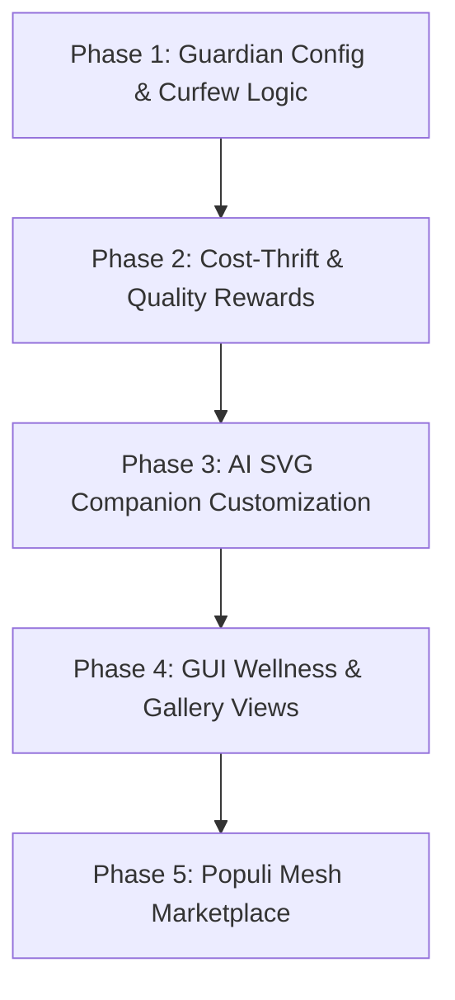

# Vox Gamification (Ludus) Architecture Review & Gaps (2026)

This document presents a comprehensive review of the **Vox Gamify / Ludus** subsystem, evaluating its architecture, optionality constraints, hooks, visual representation, and how it can be expanded to support programmer wellness, cost tracking, and collaborative SVG art generation.

---

## 1. Executive Summary

Vox gamification is an optional, offline-first subsystem designed to increase developer engagement, reinforce quality coding habits, and reduce cognitive fatigue through code companions, quests, and bug battles. 

With the launch of the **Vox GUI (Tauri/Vite/React)**, the visual and interactive capacity of gamification increases. This review audits the existing implementation in `crates/vox-gamify` and the React GUI shell, identifies severe design and feature gaps, and outlines an actionable blueprint to turn gamification into a premium, healthy tool for sustainable developer productivity.

---

## 2. Current Architecture & Implementation

The `vox-gamify` crate is structured as follows:

| Module | Core Logic | State & Persistence |
|---|---|---|
| **`config_gate.rs`** | Evaluates whether gamification is enabled (`VoxConfig::gamify_enabled`) or run in `Serious` mode (silent tracking, no overlays). | Checked by all event entry points. |
| **`profile.rs`** | Manages `LudusProfile` containing Level, XP, Prestige, Streaks, Grace Days, Lumens (currency), and Crystals. | Stored in `gamify_profiles` (VoxDb). |
| **`companion.rs`** | Implements code companions with mood mechanics (Happy, Sad, Excited, Tired), personalities (Cheerful, Focused, Edgy, Wise, Quirky), health, and energy. | Stored in `gamify_companions`. |
| **`quest_engine.rs`** | Handles daily quest generation and validation against objectives. | Stored in `gamify_quests`. |
| **`battle.rs`** | Simulates battles against compiler bugs. | Ephemeral state during `vox ludus battle`. |
| **`cost.rs`** | Aggregates token usage and costs incurred by AI API providers (Gemini, OpenRouter). | Stored in `cost_records`. |
| **`sprite_svg.rs`** | Generates inline SVG fragments for companions using deterministic templates. | Rendered in the GUI dynamically. |
| **`ai` (Subdir)** | Cascades multi-provider AI requests (Ollama, Pollinations, Gemini, Deterministic fallback) for dynamic ASCII art and hints. | Ephemeral network/local calls. |

---

## 3. Comparative Prior Art

To design a premium developer experience, we draw inspiration from successful gamification and wellness projects:

1. **Habitica**: Demonstrates the value of a shared party system (Quests, Boss battles) and strong penalties for negative habits. Gaps filled: voxel/sprite visualization, social accountability.
2. **Forest (Focus App)**: Rewards concentration by planting virtual trees; leaving the app kills the tree. Gaps filled: positive reinforcement of uninterrupted focus blocks.
3. **RescueTime / Cold Turkey**: Focus on anti-addiction, screen limits, and hard lockouts. Gaps filled: curfew enforcement, RSI stretch reminders, and site/app blocking.
4. **GitXiv / git-game**: Connects git achievements directly to XP. Gaps filled: compiler-quality and version-control integration.

---

## 4. Identified Gaps

We have identified several critical gaps in the current implementation across five dimensions:

### 4.1 Gaps in Optionality & Performance Isolation
* **Passive DB Overheads**: Although `is_enabled()` blocks side effects (like notifications or logs), the orchestrator event ingestion hooks (`ingest_orchestrator_event`) and LSP telemetry streams still perform table scans and basic checks. When gamification is disabled, there should be a short-circuit bypass at the entry point of the telemetry thread.
* **Storage Footprint**:ephemeral data from battles or old notifications remains in the SQLite database, cluttering disk space. A garbage collection policy for old gamification data is missing.

### 4.2 Gaps in Hooks & Telemetry
* **Quality & AST Metrics**: Rewards are primarily driven by *activity* (e.g., writing code, submitting tasks, completing quests) rather than *quality*. We do not hook into:
  - AST complexity delta: reducing cognitive complexity should reward crystals.
  - Compiler warning delta: fixing a compiler lint or `cargo clippy` warning.
  - Test coverage improvement: increases companion health/energy.
* **Doubt & Replay Hooks**: When a user inputs `/doubt` or overrules an agent, the companion energy drops, but there is no mechanism to reward the user for catching LLM hallucinations.

### 4.3 Gaps in Healthy Habits & Anti-Addiction
* **Cognitive Curfews**: Developers face burnout and sleep deprivation. There is no config boundary for self-imposed lockouts (e.g., no coding past 11 PM or maximum 3 consecutive hours).
* **RSI Stretch/Breathing Quests**: The system lacks passive "wellness quests" that incentivize taking a break.
* **Hard Lockout Rules**: If a developer breaks their curfew, the companion cannot enforce boundaries beyond a mood change to `Tired`. There is no optional "hard curfew lockout" that disables task execution.

### 4.4 Gaps in Cost Control & Thrift
* **Saving-to-Earning Loop**: AI cost is tracked in `cost.rs` and compared to a budget cap, but this is a negative constraint. There is no positive reinforcement loop: if a task is completed using 50% fewer tokens than the budget estimate, the savings should be converted to crystals or lumens.
* **Token footprint ranking**: The leaderboard only tracks XP and level. It does not rank developers based on "financial efficiency" or "token thrift".

### 4.5 Gaps in SVG Art & Marketplace/Gallery
* **AI SVG Generation is Unwired**: While `validate_svg` exists in `ai/validate.rs`, the actual code companions still render only the deterministic templates in `sprite_svg.rs`. There is no user-facing CLI or GUI action to generate a custom SVG sprite using AI.
* **Art Prompt Marketplace**: There is no platform to save generated SVGs, share prompts, or vote on community-made companion skins.
* **Visual Telemetry Representation**: The GUI does not visually represent what is going on in real-time within the compiler/orchestrator (e.g., companion sprite physically moving across a diagram as compilation steps complete).

---

## 5. Expansion Blueprint

To address these gaps, we propose a three-part enhancement plan:

### Track A: Programmer Wellness & Self-Imposed Rules
We will introduce **Guardian Rules** (Wellness Policies) inside `Vox.toml` and `VoxDb` to protect developers from burnout and cost slippage:

```toml
[ludus.guardian]
enable_curfew = true
curfew_start = "22:00"
curfew_end = "06:00"
max_consecutive_hours = 3.0
break_duration_mins = 15
lockout_mode = "soft" # "none" | "soft" (nag screens, zero rewards) | "hard" (blocks task submission)
daily_llm_budget_usd = 2.00
```

1. **Curfew & Break Checks**: The compiler LSP/orchestrator will check these rules during telemetry ingestion. If violated:
   - Companion shifts mood to `Tired` / `Sad`.
   - The GUI displays a prominent, soothing banner recommending rest.
   - If `lockout_mode = "hard"`, the orchestrator returns `Err("Guardian Curfew Active. Go rest!")` unless overridden with a `Streak Shield` (creating a fun cost for overworking).
2. **Break Quests**: A new quest type `QuestType::WellnessBreak` is generated when consecutive coding exceeds 2.5 hours. It requires 15 minutes of zero keyboard activity to complete, rewarding 100 crystals.

### Track B: Cost Thrift & Quality Hooks
1. **Eco-Rewards**: Calculate estimated cost vs actual cost for each orchestrator run. If `actual_cost < estimated_cost`, credit `Crystals = (estimated - actual) * 1000`.
2. **AST Refactoring Rewards**: Hook into the parser/semantic engine. When a git commit decreases function complexity (cognitive depth) while keeping tests green, award high XP.
3. **Lumen Thrift Leaderboard**: Add a `Thrift` tab on the leaderboard, showing who completed tasks with the lowest USD footprint.

### Track C: AI Art Gallery & Custom Sprite Marketplace
1. **AI SVG Generation Action**:
   - Add a command: `vox ludus companion redesign <companion_id> --prompt "a tiny cute roman scriba robot"`
   - Uses `FreeAiClient` with a strict SVG generation prompt (e.g., must return only valid XML, no script, viewBox "0 0 64 64").
   - Passes output through `validate_svg` and saves it to the companion's DB record.
2. **The Ludus Art Gallery (GUI)**:
   - A dedicated tab in the `GamifyView` showing historical generated sprites.
   - Allows users to export SVGs or prompt configurations.
3. **P2P Marketplace on Populi Mesh**:
   - Since Vox has a gossip-based VCS mesh (`vox-populi`), users can publish their SVG skins to the mesh.
   - Other nodes can browse and adopt skins, rewarding the creator with `Generosity Lumens`.

---

## 6. Recommended Implementation Phasing



### Phase 1: Guardian Config & Curfew Logic
- Add `GuardianConfig` to `VoxConfig` schema.
- Implement curfew check in `config_gate.rs` and block task submission if `hard` lockout is active.
- Create `WellnessBreak` quest templates in `quest.rs`.

### Phase 2: Cost-Thrift & Quality Rewards
- Modify `process_rewards.rs` to compute cost savings and award crystals.
- Hook compiler CLI output (complexity changes, clippy fixes) into `ingest_orchestrator_event`.

### Phase 3: AI SVG Companion Customization
- Implement AI prompt template for SVG sprites in `sprite_svg.rs`.
- Wire `vox ludus companion redesign` command.
- Implement DB storage and updates for custom SVG bodies.

### Phase 4: GUI Wellness & Gallery Views
- Add wellness banners in the GUI shell when curfews trigger.
- Build the "Companion Wardrobe / Art Gallery" inside `GamifyView`.
- Build the "Thrift" leaderboard tab.

### Phase 5: Populi Mesh Marketplace
- Extend the `vox-populi` gossip model to index published companion skins.
- Implement the peer-to-peer download and tip (Generosity Lumens) flow.
