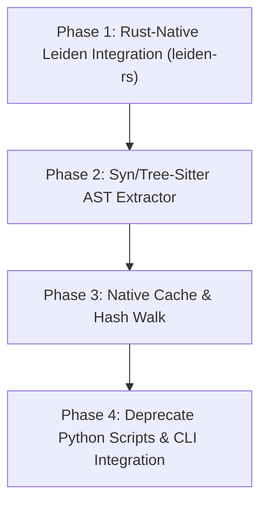

# Graphify Python-Free Transition Findings (2026)

## 1. Context & Objective
Vox has successfully implemented the P0/P1 gaps for the **Graphify Graph Run Lifecycle** in Rust:
- **Registry and Freshness (P0):** Multi-corpus manifest tracking, lexical lag detection, and TTL expirations are processed natively in `vox-config` and `vox-cli`.
- **Search & Persistence (P1):** Ephemeral and persisted lexical search mapping to `knowledge_nodes` (Turso).
- **Structural Reader (P2):** Pure Rust BFS traversal, shortest-path calculation, god-nodes ranking, and community membership lookups implemented in the `vox-graphify-reader` crate.
- **MCP Integration:** Multi-tool endpoint exposure via `vox-orchestrator-mcp`.

However, the **graph construction** phase (parsing files, AST call-graph extraction, and Leiden community clustering) is still hybrid, relying on the Python `graphify` library and `rebuild_full_graph.py`. The objective of this research is to evaluate this hybrid bottleneck and detail the roadmap to a **100% Python-free** architecture.

---

## 2. Current Architecture & Python Dependencies
Currently, when a corpus is reported as `stale` due to `graph_missing` or `git_drift`, the refresh pipeline invokes:
```
scripts/graphify-refresh.vox → rebuild_full_graph.py → python -m graphify
```

The Python-side `graphify` library depends on:
1. **Parser & Extractor:** Python `tree-sitter` bindings to walk directories and extract function decls, references, and imports.
2. **Graph Builder:** `networkx` to represent the node-link graph structure in-memory.
3. **Clustering Engine:** `graspologic` (which wraps C++ implementations) to run the **Leiden** community detection algorithm.
4. **Export Engine:** Outputs the nested JSON schema matching the contract registry.

### Limitations of the Hybrid Approach
- **Developer Onboarding Friction:** Requires a Python runtime, `pip install graphifyy`, and correct compiler tools for native C++ graspologic extensions on Windows (which frequently fails on MSVC compiler boundaries).
- **Runtime Performance & File Locks:** Windows file locks prevent Cargo from compiling while `vox` runs the python interpreter, complicating dev loops.
- **FinOps Cost:** Document/multimodal extractors call external LLM APIs, tracking token usage via an ad-hoc `cost.json` file rather than Vox's unified `vox-telemetry` cost accounting.

---

## 3. Web & Ecosystem Audit (Rust Parity Options)
Based on ecosystem research, we can construct the extraction and clustering pipeline entirely in Rust using the following crates:

### 3.1 Graph Clustering (Leiden Algorithm)
- **`leiden-rs` (Recommended):** Implements the Leiden algorithm in pure Rust. Crucially, it provides native adapters for `petgraph` structures, supporting unweighted/weighted, directed/undirected graphs, hierarchical outputs, and seedable RNGs.
- **`single-clustering`:** Extremely fast CSR-based implementation of Louvain/Leiden, but requires converting to its internal network format first.

### 3.2 AST & Call-Graph Extraction
- **`syn` & `visit` (Rust-Specific):** Provides a compile-time compiler-faithful parser. Ideal for deep analysis of Rust crates, trait implementations, and macro expansions.
- **`tree-sitter` (Multi-Language):** Native Rust bindings to query Concrete Syntax Trees (CST). Using tree-sitter queries with `tree-sitter-graph` allows building generic syntax graphs across 19+ languages without compiler dependencies.

---

## 4. Python-Free Transition Roadmap



### Phase 1: Rust-Native Leiden Integration
- **Objective:** Eliminate `networkx` and `graspologic` dependencies.
- **Crate:** Add `leiden-rs` and `petgraph` to a new module `vox-graphify-reader::cluster`.
- **Task:** Write a Rust function that accepts a list of extracted edges, builds a `petgraph::Graph`, runs `leiden_rs::Leiden`, and assigns nodes to hierarchical communities.

### Phase 2: AST Extractor (Rust & Multi-Language)
- **Objective:** Eliminate python `tree-sitter` extractor.
- **Task:** Build a native binary/library feature in `vox-compiler` or `vox-graphify-reader` using `tree-sitter` bindings.
- **Hybrid Resolution Strategy:** For deep Rust-specific parsing (macro expansion, trait resolution, type alias tracing), use `syn` & `visit`. Use the generic `tree-sitter` parser for multi-language files.
- **Compilation Guard:** Feature-gate tree-sitter grammars (e.g. `features = ["rust", "typescript", "javascript"]`) in `Cargo.toml` to prevent compiling unused language grammars, keeping compiler overhead on Windows low.
- **Queries:** Port the Python Graphify tree-sitter patterns to declarative `.scm` query files. Execute these queries over scanned files to output structural nodes (`fn`, `struct`, `module`) and edges (`calls`, `imports`).

### Phase 3: Native Cache and File Walking
- **Objective:** Eliminate Python `cache.py` and `os_compat.py`.
- **Task:** Implement standard `walkdir` walking. Compute `blake3` file hashes to implement incremental updates (skipping unmodified files by matching their cached hashes).
- **Cache Schema:** Serialize extracted node-link subgraphs into lightweight JSON/BSON cache files. Store them under the Tier D cache path (`.vox/cache/graphify/<corpus_id>/file_cache/`) to avoid workspace pollution.

### Phase 4: Deprecate Python Scripts & CLI Integration
- **Task:** Expose a new subcommand `vox graphify rebuild` in `vox-cli` to orchestrate AST extraction, Leiden clustering, and graph output generation in-process.
- **Task:** Remove `rebuild_full_graph.py` and all 19 Python scripts under `scripts/coverage-graph/`.
- **Action:** Convert the semantic coverage analysis (`merge_behaviors_to_graph.py`, `ingest_reaches.py`), static overlays (`overlay_tests.py`), and log synthesis (`recover_and_synth.py`) to native `.vox` scripts or CLI commands.

---

## 5. Enhanced Availability & Traversal Design
To scale the structural reader to monorepos exceeding 10,000 nodes, we must enhance runtime availability:
1. **Async spawn_blocking:** Offload heavy `serde_json` parsing and petgraph BFS traversals in `graphify_tools.rs` to a tokio worker pool via `spawn_blocking`.
2. **Batch Ingestion & Transactions:** Instead of concurrent single-insert requests (which cause write-lock contention on SQLite/Turso databases), wrap all inserts inside a **single database transaction** (e.g., via multi-value `INSERT` or transaction block). This reduces disk synchronization overhead from $O(N)$ to $O(1)$.
