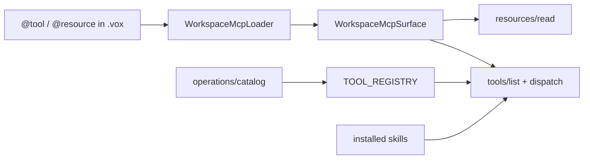

# MCP Vox language exposure

Workspace MCP tools declared with `@tool` (formerly `@mcp.tool`) and resources declared with `@mcp.resource` in `.vox` source are **federated into `vox-mcp`** at bind time (Option A). The orchestrator exposes a single `tools/list` + `call_tool` + `resources/list` + `resources/read` plane that merges:

1. **Static catalog tools** from `contracts/operations/catalog.v1.yaml` → `vox_mcp_registry::TOOL_REGISTRY`
2. **Federated workspace tools/resources** from `WorkspaceMcpLoader` scanning globs in `contracts/mcp/workspace-mcp-surface.v1.yaml`
3. **Skill macro tools** from installed skills (`vox_skill_*` tier-2)
4. **Skill SEP-2640 resources** (`skill://index.json`, `skill://{id}/SKILL.md`)

Per-crate generated stdio MCP servers (`emit_mcp_server` in `vox-codegen`) remain for **embedded app binaries** only; agents attached to the repo should use **`vox-mcp`** as the single orchestrator surface.

## Federation flow

## Collision rules

- **Static catalog wins.** If a workspace tool name collides with a catalog `vox_*` tool, the workspace entry is **shadowed** (warn-logged, not advertised). Shadowed names appear in `vox_workspace_mcp_refresh` diagnostics.
- **Duplicate names/URIs:** Second occurrence across scan globs is skipped (warn-logged); first file wins.
- **Per-file errors:** A compile failure in one `.vox` file does **not** abort the whole scan; errors are collected and logged.
- **Refresh:** `vox_workspace_mcp_refresh` rescans the repo, updates `ServerState.workspace_mcp`, and returns `{ tool_count, resource_count, shadowed, duplicate_tools, duplicate_resources, errors }`.

## Dispatch

- **Tools:** Federated `@tool` functions run via the Vox interpreter (`vox_compiler::eval::Interpreter`). JSON args map to `VoxValue`; optional HIR parameters (with defaults) are omitted from JSON Schema `required`.
- **Resources:** Federated `@mcp.resource` functions are nullary; `resources/read` invokes the declaring fn and returns its `str` body.

## MCP tier policy

`VOX_MCP_TIERS` filters `tools/list` by `vox_tier` metadata (default: `core` only):

| Tier | Source |
|------|--------|
| `core`, `dev`, `advanced` | Static catalog (`TOOL_REGISTRY`) |
| `workspace` | Federated `@tool` declarations |
| `skill` | Instructional macro tools from installed skills |

Set `VOX_MCP_TIERS=all` to advertise every tier.

## CI gates

| Gate | Command |
|------|---------|
| Surface parity | `vox ci mcp-vox-surface-parity` |
| Static wiring | `vox ci operations-verify` |
| AgentSkills format | `vox ci agentskills-compliance` |

Fixture round-trips live in `contracts/mcp/workspace-tool-fixtures.v1.json` (tools + resources).

## Skills interop

- **Discovery:** `skill_search_roots()` + boot-time `hydrate_external_skills` (stdio MCP **and** daemon hosts)
- **Search:** BM25 index in `skill_search_index` (rebuilt on install/uninstall/hydrate)
- **SEP-2640:** `skill://index.json` and `skill://{id}/SKILL.md` resources
- **Permissions:** `vox_skill_use` and chat composer `active_skill` set `active_skill_id`. When a skill manifest lists non-empty `tools`, dispatch enforces that allowlist. **Empty `tools` = unrestricted.** Infrastructure tools (`vox_skill_*`, `vox_workspace_mcp_refresh`, `vox_chat_*`) are always allowed while a skill is active.
- **Sandbox:** `vox_skill_run` wraps `SandboxedSkillRunner` (CLI parity). Callers supply the command; trust boundary is installed skill id + sandbox policy.

## Canonical decorator

Use `@tool`, not `@mcp.tool`. The compiler emits `vox/decorator/mcp-tool-deprecated` (warning) for legacy `@mcp.tool`.
