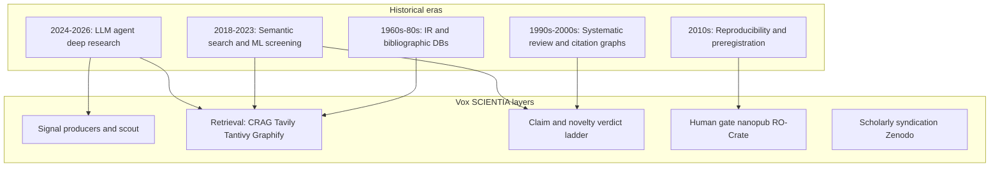
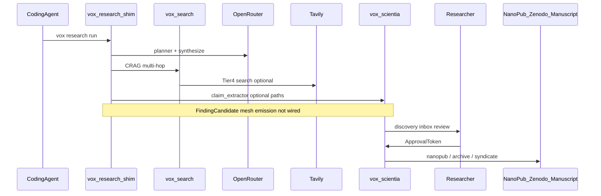

# SCIENTIA Automated Research: Historical Roles and Extension Research (2026)

## 1. Executive summary

Vox **SCIENTIA** is more than a nanopublication emitter: it is a knowledge platform (`vox-scientia`) plus publication orchestration (`vox-publisher`), fed by deep research (`vox-research-shim`) and hybrid retrieval (`vox-search`). Nanopubs are one **rigor tier** on the output ladder — alongside Zenodo deposits, RO-Crate packages, manuscript scaffolds, and syndication — all behind a human-gated review SSOT.

This document:

1. Maps **historical roles** of computers and AI in scientific research (1960s–2026) to Vox capabilities and gaps.
2. Records a **severity-ordered code review** of the current SCIENTIA + research integration (June 2026).
3. Proposes a **unified research loop** that connects coding agents, spontaneous research, and optional gamification.
4. Sequences extension work aligned with existing plans (Tracks A–E plus **Track F: Unified research loop**).

**Term disambiguation (common voice-transcription confusions):**

| Spoken / written | Vox canonical |
|------------------|---------------|
| TAN, TANTIVLY | **Tantivy** — Rust full-text index behind `tantivy-lexical` / `VOX_SEARCH_TANTIVY_ROOT` |
| Tavily, Tavoli | **Tavily** — live web retrieval vendor; Rust SDK in `vox-search` |
| Graphify | External **Graphify** pipeline + local `graphify-out/` convention; P0 status in Vox |

External research for §2 used Tavily Research API (2026-06-16) plus NLM/Cochrane/nanopub primary sources. Tavily CLI (`tvly`) was unavailable in the agent environment; MCP `tavily_research` was used instead.

---

## 2. Historical roles of computers and AI in research

Five eras structure how automated research evolved and what researchers still expect tools to save.

### 2.1 Era timeline with citations

| Year | Milestone | Capability | Researcher time impact | Primary source |
|------|-----------|------------|------------------------|----------------|
| 1960s | MEDLARS mechanized indexing | Batch bibliographic processing at NLM | Weeks → days for curated index updates | [NLM MEDLARS history](https://pmc.ncbi.nlm.nih.gov/articles/PMC2000779/) |
| 1971 | MEDLINE online search | Interactive biomedical literature retrieval | Search weeks → **minutes** | [NLM Circulating Now](https://circulatingnow.nlm.nih.gov/2016/03/30/medlars-ii-medline-instantaneous-search/) |
| 1993 | Cochrane Collaboration | Standardized systematic review methods | Reduced ad-hoc duplication; reviews still multi-month | [Cochrane Handbook Ch. I](https://www.cochrane.org/authors/handbooks-and-manuals/handbook/current/chapter-i) |
| 2010 | Nanopublications (Groth et al.) | Atomic, signed, RDF-linked scientific assertions | Full paper → citable micro-assertion | [Groth et al. 2010](https://doi.org/10.3233/ISU-2010-0613) |
| 2012+ | OSF registrations / preregistration | Time-stamped, frozen study plans | Post-hoc bias → auditable protocol | [OSF Registrations guide](https://help.osf.io/article/330-welcome-to-registrations) |
| 2015 | Semantic Scholar | AI-enhanced paper discovery and TL;DR summaries | Manual scan → ranked semantic results | [Semantic Scholar About](https://www.semanticscholar.org/about) |
| 2019 | RO-Crate 1.x | FAIR packaging of data, software, metadata (JSON-LD) | Manual provenance assembly → structured crate | [RO-Crate introduction](https://www.researchobject.org/ro-crate/specification/1.2/introduction.html) |
| 2023–24 | Elicit systematic review | LLM-assisted screening and extraction (PRISMA-oriented) | Up to ~80% review time reduction (vendor claim) | [Elicit systematic review](https://elicit.com/blog/systematic-review) |
| Feb 2025 | OpenAI Deep Research | Multi-step autonomous web research agent | Tasks framed as days/weeks of human work → minutes | [OpenAI introducing deep research](https://openai.com/index/introducing-deep-research) |
| 2025–26 | Gemini Deep Research | Plan → search → read → iterate → cited report (async) | Literature review / due diligence acceleration | [Gemini Deep Research API](https://ai.google.dev/gemini-api/docs/deep-research) |
| 2026 | Tavily `/research` endpoint | Single-call multi-hop vendor research for agents | Replaces hand-rolled search loops for integrators | [Tavily Jan 2026 ship blog](https://www.tavily.com/blog/what-tavily-shipped-in-january-26) |

### 2.2 Historical capability → Vox mapping

| Historical capability | Vox today (shipped) | Missing for “more than nano publisher” |
|----------------------|---------------------|----------------------------------------|
| Batch literature search | Tavily `/search` Tier 4 + OpenAlex/Crossref/S2 prior art | Tavily `/research`, `/extract`, `/crawl`; arXiv-native tier; citation-diversity gate |
| Citation chaining | `publication-novelty-fetch` federated prior art | Mandatory embedding path; SPECTER2/Qdrant KNN in novelty scoring |
| Systematic review screening | `claim_extractor` + MiniCheck verdict ladder | Batch screening UI; inter-rater export; PRISMA trace |
| Preregistration | Orchestrator `preregistration/` + `scientia_prereg` table | **Doc drift:** gap map cites `crates/vox-prereg/` (absent); see §8 |
| Reproducibility packages | RO-Crate + replay runner scaffold | Measured replay score auto-written to worthiness rubric |
| Semantic literature AI | SCIENTIA claim pipeline on publication path | Auto-bridge from `vox research run` sessions |
| Agent deep research | `run_research` + CRAG multi-hop + MCP `vox_research_run` | Reliable planner; mesh emission; eval harness |
| Micropublications | Offline RSA nanopub + test-server gate | Aggregate approved claims → IMRaD manuscript (Gap C) |
| Codebase knowledge graphs | Graphify P0 (`vox graphify status`) | P1 lexical ingest + MCP query in retrieval bundle |
| Model routing observability | OpenRouter catalog + research Lane G synthesis | Provider Atlas → `ModelRegistry` feedback loop |

**Design implication:** SCIENTIA should operate as a **research OS** — discover → retrieve → extract → assess novelty → human approve → emit at chosen rigor — with coding-agent sessions writing into the same ledger as spontaneous literature research.

---

## 3. Current architecture

**Crate responsibilities:**

| Crate | Role |
|-------|------|
| `vox-scientia` | Claims, novelty inspect bridge, review flow, nanopub, RO-Crate, producers, manuscript scaffold |
| `vox-publisher` | Prior art fetch, worthiness, syndication, discovery ranking, research mesh intake |
| `vox-research-shim` | `run_research` pipeline, session persistence, web gather |
| `vox-search` | CRAG, web tier, Tavily client, optional Tantivy/Qdrant |
| `vox-research-events` | Contract types: `FindingCandidateV1`, `ResearchEvent`, mesh broadcast |

Human-gated review SSOT: [`review_flow.rs`](../../../crates/vox-scientia/src/review_flow.rs). Four-layer no-auto-publish design: [`scientia-micropublication-ssot-and-surfacing-design-2026.md`](scientia-micropublication-ssot-and-surfacing-design-2026.md).

---

## 4. Code review findings (June 2026)

Ordered by severity. Status updated after June 2026 implementation waves.

**Fixed June 2026:** findings **1** (scientia-claims feature), **4** (empty/no-trace → `InsufficientEvidence`), **6** (`planner_degraded` + user-visible metadata), **14** (cache store via `upsert_knowledge_node`). **Fixed implementation waves (June 2026 plan):** **2** (embedder fail-fast + golden harness), **3** (bundle SSOT unification), **5** (discovery bridge + mesh), **7** (Tavily extract/research tiers), **8** (Graphify P1 lexical leg), **9** (assess_novelty callsite audit), **11** (research kudos when gamify enabled).

### 4.1 Critical — correctness / trust

1. **Research shim claim path diverges from SCIENTIA claim extractor** — **FIXED June 2026** (`scientia-claims` feature routes through `claim_extractor` first)
   - [`claims.rs`](../../../crates/vox-research-shim/src/research/claims.rs) uses LLM cascade when `runtime` feature is on, else returns empty claims.
   - [`claim_extractor/pipeline.rs`](../../../crates/vox-scientia/src/claim_extractor/pipeline.rs) is the real VeriScore → atomic → MiniCheck pipeline.
   - **Risk:** `vox research run` can complete with zero claims while `publication-extract-claims` produces verdicts.

2. **Novelty scoring without embedder degrades to lexical-only** — **MITIGATED June 2026** (`require_embedder_for_online_novelty` when `VOX_SCIENTIA_REQUIRE_EMBEDDER=1`; golden harness added)
   - [`scientia_prior_art.rs`](../../../crates/vox-publisher/src/scientia_prior_art.rs) enriches semantic scores only when caller supplies [`Embedder`](../../../crates/vox-publisher/src/scientia_semantic.rs).
   - **Risk:** false Novel/NotNovel at scale; no measured precision/recall harness yet ([upgrade plan Track A](../../superpowers/plans/2026-06-12-scientia-research-pipeline-upgrade.md)).

3. **Bundle type drift** — **FIXED June 2026** (`NoveltyEvidenceBundleContract` alias + parity tests)
   - Hand-written `NoveltyEvidenceBundleV1` (publisher) vs typify types in `vox-research-events` — conversion seams at [`research_mesh.rs`](../../../crates/vox-publisher/src/research_mesh.rs) and MCP tools.

4. **Empty query traces still score Novel** — **FIXED June 2026**
   - [`novelty.rs`](../../../crates/vox-scientia/src/inspect_bridge/novelty.rs) gates `InsufficientEvidence` when all traces fail, but bundles with **no traces** and empty hits remain `Novel`.
   - **Risk:** offline runs appear novel when retrieval never executed.

### 4.2 High — pipeline fragmentation

5. **Deep research and SCIENTIA are parallel, not unified** — **FIXED June 2026** (`discovery_bridge.rs` persists finding candidates; mesh emission + session telemetry)
   - `run_research` persists sessions but does **not** emit `FindingCandidateV1` / `DiscoverySignal` into SCIENTIA mesh ([deep-research roadmap §6](deep-research-prior-art-and-vox-roadmap-2026.md)).
   - Largest researcher time sink: manual re-entry into publication manifests.

6. **Planner silent fallback** — **FIXED June 2026** (`planner_degraded` on plan + metadata JSON)
   - [`planner.rs`](../../../crates/vox-research-shim/src/research/planner.rs) passthroughs on cascade failure; CRAG multi-hop then runs on a single query.

7. **Tavily `/research` and `/extract` unwired** — **FIXED June 2026** (`tavily_extract.rs`, `tavily_research.rs` behind env flags)
   - Only Tier-4 `/search` in [`web_dispatcher.rs`](../../../crates/vox-search/src/web_dispatcher.rs). See [`tavily-integration-ssot.md`](../reference/tavily-integration-ssot.md) — do not duplicate endpoint tables here.

8. **Graphify not in retrieval bundle** — **PARTIAL June 2026** (P1 lexical leg in `scientia_prior_art.rs`; full MCP query tool still open)
   - P0 status only; no `vox_graphify_search` MCP tool ([graphify-integration-research-2026-06-16.md](graphify-integration-research-2026-06-16.md)).

9. **Novelty assess path vs raw scorer** — **FIXED June 2026** (arch test guards; CLI/GUI/MCP route through `assess_novelty`)
   - `ChronoFilter` and `EvidenceConflictDetector` **are** wired in [`assess_novelty()`](../../../crates/vox-publisher/src/scientia_novelty_assess.rs), but not all CLI/GUI paths may call `assess_novelty` vs raw `AtomicNoveltyScorer::score` — verify at each callsite before claiming full temporal/conflict coverage.

### 4.3 Medium — UX and ops

10. **GUI covers ~10% of scientia CLI** — [`vox-gui-scientia-coverage-audit-2026.md`](vox-gui-scientia-coverage-audit-2026.md).
11. **Gamification = Console discovery exposure only** — **PARTIAL June 2026** (`research_session_complete` kudos when gamify enabled; publication never gated)
12. **Prereg documentation drift** — see §8.
13. **`graphify-out/` collision** with CI artifacts blocks trustworthy P1 ingest.
14. **Pipeline cache always miss** — **FIXED June 2026** (store + read both use `knowledge_nodes` via `upsert_knowledge_node` / `list_memories_by_type`) — [`pipeline_cache.rs`](../../../crates/vox-research-shim/src/research/orchestrator/pipeline_cache.rs).

### 4.4 Low

15. Production nanopub network publish intentionally unimplemented (correct posture).
16. OpenRouter spend HUD tile contract exists; GUI tile incomplete.
17. Tantivy behind `heavy-retrieval` — lean builds lack local lexical corpus.

### 4.5 Positive (preserve)

- Human-gated review + `ApprovalToken` in `review_flow.rs`.
- `InsufficientEvidence` verdict + empty bundle with `None` scores (June 2026 fixes).
- `Contradicted` claim verdict reachable via MiniCheck contradiction path.
- Web gather + CRAG multi-hop shipped; CLI + MCP research surfaces exist.
- Embedder seam + code-uniqueness producer scaffold for automated discovery.

---

## 5. Integration matrix

| Integration | Shipped | Planned / stub | SSOT |
|-------------|---------|----------------|------|
| **OpenRouter** | `vox_actor_runtime::llm`, routing policy, live catalog, research synthesis Lane G | Unified `model-routing.v1.yaml`; GUI spend tile | [`model-orchestration-ssot-audit-2026.md`](model-orchestration-ssot-audit-2026.md) |
| **Tavily** | `/search` via `TavilySearchClient`; budget + fail-open | `/extract`, `/research`, `/crawl` | [`tavily-integration-ssot.md`](../reference/tavily-integration-ssot.md) |
| **Tantivy** | `lexical_tantivy.rs` behind feature | Default-on for research builds; 0.22→0.26 bump | [`search-retrieval-ssot-2026.md`](search-retrieval-ssot-2026.md) |
| **Vox Search** | CRAG, web tier, retrieval bundle, `run_multi_hop_web_research` | Wikipedia/arXiv/S2 dedicated tiers | Same |
| **Graphify** | Registry + `vox graphify status` / MCP `vox_graphify_status` | P1–P3 search + MCP query tools | [`graphify-integration-research-2026-06-16.md`](graphify-integration-research-2026-06-16.md) |

All LLM calls must stay on `vox_actor_runtime::llm` per root [`AGENTS.md`](../../../AGENTS.md) — no direct vendor SDKs at callsites.

---

## 6. Researcher time-savings backlog (ranked)

Priority = estimated **hours saved per active researcher per month** divided by **implementation cost** (S/M/L).

| Rank | Gap | Est. time saved | Cost | Track |
|------|-----|-----------------|------|-------|
| 1 | Unified research → SCIENTIA mesh emission | 4–8 h/mo (no manual re-entry) | M | F |
| 2 | Route `vox research run` claims through `vox-scientia` extractor | 2–4 h/mo (consistent verdicts) | S | F |
| 3 | Mandatory embedder on novelty-fetch | 1–3 h/mo (fewer false novelty decisions) | S | A |
| 4 | Tavily `/extract` for weak snippets | 1–2 h/mo (less manual page reading) | M | Phase 3 |
| 5 | Graphify P1 in retrieval bundle | 1–2 h/mo (structural codebase answers) | L | Phase 3 |
| 6 | Novelty eval harness (precision/recall) | Prevents costly false publishes | M | A |
| 7 | Collated results dashboard (session → archive) | 1 h/mo (status visibility) | M | Phase 4 |
| 8 | IMRaD manuscript scaffold from approved claims | 2–5 h per publication | L | Phase 4 |
| 9 | Optional gamify kudos for research milestones | Engagement; not blocking | S | Phase 5 |
| 10 | Pipeline cache for identical queries | API cost; marginal wall-clock | M | Ops |

---

## 7. Unified pipeline proposal

### 7.1 Spontaneous research during coding

When Socrates policy or explicit `vox research run` triggers:

1. **Plan** — OpenRouter cascade in `planner.rs` (must surface failure to user, not silent passthrough).
2. **Retrieve** — `vox-search` CRAG loop; Tavily when policy enables; future Tantivy for repo-local legs.
3. **Ground** — `vox_scientia::claim_extractor` on synthesis + evidence passages.
4. **Assess** — `assess_novelty()` with embedder + chrono/conflict on candidate claims.
5. **Surface** — emit `FindingCandidateV1` to mesh → GUI `DiscoveryInbox` + WS `scientia.discovery.surfaced`.
6. **Human gate** — `record_claim_review()` → `ApprovalToken`.
7. **Emit** — user-selected rigor: nanopub build, Zenodo archive run, manuscript draft, syndication.

### 7.2 Collated results

One **publication session** (`publication_session_id` from [`review_flow.rs`](../../../crates/vox-scientia/src/review_flow.rs)) should aggregate:

- Research session IDs (`scientia_research_sessions`)
- `NoveltyEvidenceBundle` artifacts
- Claim verdicts
- Review decisions
- Archive status (Zenodo / SWH / nanopub test server)

Extend [`ScientiaDashboard.tsx`](../../../crates/vox-gui/ui/src/components/surfaces/Scientia/ScientiaDashboard.tsx) rather than adding a parallel surface.

### 7.3 Optional gamification

When `[gamify]` is enabled:

- Emit mesh kudos (not XP inflation) for `research_session_complete`, `novelty_assessed`, `publication_approved`.
- Reuse Console discovery ledger pattern (`vox.scientia.review` action id) — surface streaks in StatusBar only; **never** gate publication on gamify state.

---

## 8. Documentation drift: preregistration

Three sources disagree on prereg location:

| Source | Claim |
|--------|-------|
| [`scientia-self-publication-gap-map-2026.md`](scientia-self-publication-gap-map-2026.md) §0 | `crates/vox-prereg/` complete |
| [`where-things-live.md`](where-things-live.md) | Points to `crates/vox-prereg/` |
| [`vox-scientia/src/lib.rs`](../../../crates/vox-scientia/src/lib.rs) | Comment: `prereg` still planned in this crate |
| **Workspace reality (2026-06-16)** | **No `vox-prereg` crate** in root `Cargo.toml`; implementation lives under [`vox-orchestrator/src/preregistration/`](../../../crates/vox-orchestrator/src/preregistration/) + `scientia_prereg` DDL in [`vox-db`](../../../crates/vox-db/src/schema/domains/scientia.rs) |

**Follow-up:** Update gap map and `where-things-live.md` in a dedicated doc-hygiene PR; wire orchestrator prereg gate to SCIENTIA publication CLI where still missing.

---

## 9. Phased extension roadmap

Align with [2026-06-12-scientia-research-pipeline-upgrade.md](../../superpowers/plans/2026-06-12-scientia-research-pipeline-upgrade.md) Tracks A–E. Add **Track F: Unified research loop**.

| Phase | Focus | Key deliverables |
|-------|-------|------------------|
| **0** | Doc hygiene (this file) + prereg drift ticket | Research index link; gap map correction PR |
| **1** | Track A remainder | Mandatory embedder; bundle SSOT unification; novelty eval harness; callsite audit for `assess_novelty` |
| **2** | **Track F** (highest ROI) | Mesh emission from `run_research`; scientia claim extractor in shim; discovery inbox auto-fill |
| **3** | Retrieval depth | Tavily extract/research eval; Tantivy corpus row; Graphify P1 |
| **4** | Beyond nanopub | IMRaD scaffold; collated dashboard; Provider Atlas → model registry |
| **5** | Gamify optional | Kudos events; StatusBar streaks |

**Explicitly out of scope:** production nanopub network publish; live arXiv API submission; new shell glue scripts (VoxScript-first policy).

---

## 10. Verification commands

| Check | Command |
|-------|---------|
| Research pipeline compiles | `cargo check -p vox-research-shim -p vox-scientia -p vox-search` |
| Novelty unit tests | `cargo test -p vox-scientia inspect_bridge::novelty` |
| Prior art tests | `cargo test -p vox-publisher scientia_prior_art` |
| Novelty golden harness | `cargo test -p vox-publisher novelty_golden_harness` |
| Research CLI preview | `vox research preview "test query"` |
| Graphify status | `vox graphify status --json` |
| Doc frontmatter | `cargo run -p vox-doc-pipeline -- --lint-only --paths docs/src/architecture/scientia-automated-research-historical-extension-research-2026.md` |

---

## 11. Related SSOT links

- [Deep Research Prior Art and Vox Roadmap (2026)](deep-research-prior-art-and-vox-roadmap-2026.md)
- [SCIENTIA micropublication SSOT and surfacing design](scientia-micropublication-ssot-and-surfacing-design-2026.md)
- [SCIENTIA self-publication gap map](scientia-self-publication-gap-map-2026.md)
- [SCIENTIA × mesh integration research](scientia-mesh-integration-research-2026.md)
- [Graphify integration research (2026-06-16)](graphify-integration-research-2026-06-16.md)
- [Search & retrieval SSOT (2026)](search-retrieval-ssot-2026.md)
- [Tavily integration SSOT](../reference/tavily-integration-ssot.md)
- [Scientia research pipeline upgrade plan (2026-06-12)](../../superpowers/plans/2026-06-12-scientia-research-pipeline-upgrade.md)
- [Where things live — SCIENTIA rows](where-things-live.md)

---

## Appendix A — Tavily research request metadata

- **Request ID:** `2339f716-ebaf-4b7a-977b-5783ee7347a0`
- **Date:** 2026-06-16
- **Model:** mini
- **Response time:** ~60s
- **Method:** MCP `tavily_research` (CLI `tvly` not on PATH)
