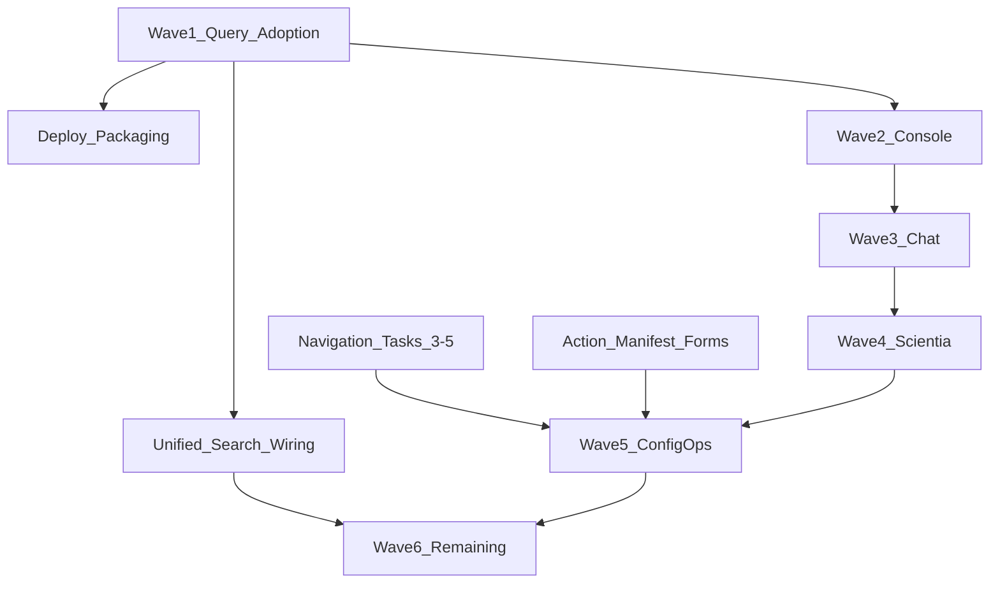

# vox-gui Master Roadmap — Remaining Work Index

> **For agentic workers:** REQUIRED SUB-SKILL: Use superpowers:subagent-driven-development (recommended) or superpowers:executing-plans to implement each linked sub-plan task-by-task.

**Goal:** Close the gap between landed Phase 0 foundations (commit `e4da27e`) and master-roadmap exit criteria for deploy, search, manifest forms, navigation polish, and Waves 1–6.

**v2 operator console (configurable dashboard, StatusBar, OmniSearch, Chat execution rail):** [`2026-06-16-gui-operator-console-v2-configurable-dashboard-omnisearch.md`](2026-06-16-gui-operator-console-v2-configurable-dashboard-omnisearch.md) — 350-item improvement catalog; supersedes dashboard/HUD/chat/search scope below.

**Architecture:** Execute in dependency order below. Each sub-plan is independently mergeable; this file is the **sequencing index only** — do not duplicate task steps here.

**Tech Stack:** Tauri 2, React 19, TanStack Query v5, vitest, Playwright, `vox ci gui-*`.

**Landed in Phase 0 commit (`e4da27e`):**
- `QueryClientProvider` + bootstrap theme via `voxTransport`
- Infra IPC migrations: `consoleBridge`, `usePersistedDbState`, `DockShell`, `CommandPalette` (docs/search transport methods)
- `visualTokens.ts`, CSP/font self-host, Memory shard row VL
- `ipcBoundaries.test.ts` guard (allowlist for surfaces still migrating)
- `BreadcrumbBar`, hash deep links (`#view=`), `hashchange`, unified `navigateTo`
- `useSearchController` hook (not yet wired to palette/SearchView)
- Nine stub sub-plans + `settings.spec.ts` e2e
- **396 vitest tests** green in `crates/vox-gui/ui`

---

## Dependency graph (remaining)



---

## Sub-plan registry

| Priority | Plan | Status after cleanup | Blocker |
|----------|------|----------------------|---------|
| **P0** | [`2026-06-16-gui-wave1-query-adoption.md`](2026-06-16-gui-wave1-query-adoption.md) | Tasks 1–5 done (vitest + dashboard-pilot e2e) | — |
| **P1** | [`2026-06-16-gui-unified-search.md`](2026-06-16-gui-unified-search.md) | Tasks 2–5 done (`useSearchController`, prefix routing, locator nav) | MemoryView still raw invoke |
| **P1** | [`2026-06-16-gui-navigation-layout.md`](2026-06-16-gui-navigation-layout.md) | Tasks 3–5 done (badges, Policies aria, Gamify IA, Coverage shortcut) | xl responsive aside polish optional |
| **P2** | [`2026-06-16-gui-deploy-packaging.md`](2026-06-16-gui-deploy-packaging.md) | Docs only | No CI `cargo tauri build` leg |
| **P2** | [`2026-06-16-gui-action-manifest-forms.md`](2026-06-16-gui-action-manifest-forms.md) | Docs only | 69 surfaces at `none` tier |
| **P3** | [`2026-06-16-gui-wave2-console.md`](2026-06-16-gui-wave2-console.md) | Partial (tokens, tests) | IPC allowlist shrink |
| **P3** | [`2026-06-16-gui-wave3-chat.md`](2026-06-16-gui-wave3-chat.md) | Tests exist | Query layer for approvals |
| **P3** | [`2026-06-16-gui-wave4-scientia.md`](2026-06-16-gui-wave4-scientia.md) | Tests exist | Checklist audit only |
| **P3** | [`2026-06-16-gui-wave5-config-ops.md`](2026-06-16-gui-wave5-config-ops.md) | Memory prefs migrated | `get_memory_status` still raw invoke |
| **P4** | [`2026-06-16-gui-wave6-remaining.md`](2026-06-16-gui-wave6-remaining.md) | Not started | Browser + Settings deep IPC |

**Existing detailed plans (reference, do not rewrite):**
- Phase 0A–0D: `2026-06-14-vox-gui-phase0{a,b,c,d}-*.md`
- Wave 1 pilots: `2026-06-14-vox-gui-wave1-pilots.md`

---

## Exit criteria still open (master roadmap)

| Criterion | Owner plan |
|-----------|------------|
| Dashboard orchestrator via `useVoxQuery` + `<Async>` | Wave1 query adoption |
| Zero production `invoke()` outside transport | Wave 6 + per-wave allowlist shrink |
| CommandPalette + SearchView share `useSearchController` | Unified search |
| ≥20 `generic_form` surfaces in registry | Action manifest |
| Tagged release + CI bundle leg | Deploy packaging |
| Policies two-rail layout | Navigation layout Task 4 |
| Playwright palette → navigate | Unified search Task 4 |

---

## CI verification (every sub-plan PR)

```bash
cd crates/vox-gui/ui && pnpm test && pnpm typecheck
cargo run -q -p vox-cli -- ci gui-smoke
# After registry changes:
cargo run -q -p vox-cli -- ci gui-surface-registry
```

Pre-push: `vox ci pre-push --complete` when Rust touched.

---

## Execution handoff

**Recommended next PR:** Begin **Phase 0** of [`2026-06-16-gui-operator-console-v2-configurable-dashboard-omnisearch.md`](2026-06-16-gui-operator-console-v2-configurable-dashboard-omnisearch.md) (layout contracts + AppShell), or continue [`2026-06-16-gui-wave2-console.md`](2026-06-16-gui-wave2-console.md) for IPC allowlist shrink.

**Two execution options:**

1. **Subagent-Driven (recommended)** — fresh subagent per task, review between tasks
2. **Inline Execution** — execute with executing-plans checkpoints in one session

Which approach?
