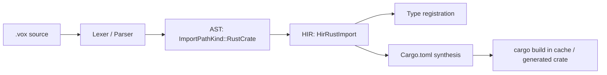

# Mermaid Rendering and Parse Gate Implementation Plan

> **For agentic workers:** REQUIRED SUB-SKILL: Use superpowers:subagent-driven-development (recommended) or superpowers:executing-plans to implement this plan task-by-task. Steps use checkbox (`- [ ]`) syntax for tracking.

**Goal:** Make the 17 live documents containing mermaid diagrams actually render them on voxlang.org, and add a CI gate so a broken diagram fails a pull request instead of failing silently in a reader's browser.

**Architecture:** Gate first, then fix, then render. A node-based parse harness runs `mermaid@11`'s real parser over every live fence and becomes the failing test; the one genuinely broken live diagram is then fixed; only then is the renderer wired in. Rendering is **client-side** (`astro-mermaid`), because the build-time alternatives require a Playwright/Chromium download on the docs build path and — decisively — would strip diagram source out of `llms-full.txt`, which agents consume.

**Tech Stack:** Astro 6, Starlight 0.38, `astro-mermaid`, `mermaid@11`, `jsdom`, pnpm, GitHub Actions.

**Spec:** `docs/superpowers/specs/2026-08-22-docs-corpus-repair-design.md` (revision 2), workstream W4

## Global Constraints

- **Covers spec workstream W4 only.** W1/W6/W7 are `docs/superpowers/plans/2026-08-22-gate-and-policy-honesty.md`. W2, W3, W5, W8 are separate efforts.
- **Do not touch `docs/src/archive/**`.** AGENTS.md §Archival Protocol. Two of the three broken diagrams are in archive; they render noindexed pages and are explicitly out of scope. Every script in this plan excludes `archive/`.
- **`--frozen-lockfile` is used in all four CI install steps** (`docs-deploy.yml:72,158,188` and `docs-quality.yml:73`). Any dependency change **must** commit the regenerated `docs-astro/pnpm-lock.yaml` in the same commit or CI fails immediately. `docs-astro/node_modules` does not exist locally — a real `pnpm install` is required.
- **`docs-quality.yml` runs on `[self-hosted, linux, x64]`**, which has no Chromium provisioning. Do not introduce a build-time renderer.
- **Client-side rendering fails soft** — a bad diagram shows an error box rather than breaking `pnpm build`. That is why the parse gate is mandatory: nothing else catches a broken diagram.
- **No new `.ps1` / `.sh` / `.py` glue** (AGENTS.md §VoxScript-First). Node scripts inside `docs-astro/` are the established pattern there (`scripts/setup-content.mjs`) and are not "glue scripts" in that policy's sense.
- **Line endings are LF** for `md`, `json`, `mjs`, `yml`.
- **Verification tier is `--full`.** `--complete` runs no tests.
- **One agent per worktree.**
- **No checker enters this plan until it has been RUN and its real output pasted into the step.** Task 1's harness was verified that way and one line of it proved fatal on Node >= 21; reasoning about it would not have caught that.
- **PR discipline:** CodeRabbit reviews once on open. Batch commits; push once.

---

## File Structure

| File | Responsibility | Task |
| --- | --- | --- |
| `docs-astro/scripts/check-mermaid.mjs` | **New.** Extracts every ` ```mermaid ` fence from live docs and parses it with the real `mermaid@11` parser under jsdom. The gate. | 1 |
| `docs-astro/package.json` | `check:mermaid` script; `mermaid` + `jsdom` devDeps; `astro-mermaid` dep | 1, 4 |
| `docs-astro/pnpm-lock.yaml` | Regenerated alongside every dependency change | 1, 4 |
| `docs/src/how-to/how-to-rust-crate-imports.md:53-61` | The one broken live diagram | 2 |
| `.github/workflows/docs-quality.yml` | Run the parse gate on PRs | 3 |
| `docs-astro/astro.config.mjs` | Register `astro-mermaid` before `starlight()` | 4 |
| `docs-astro/tests/mermaid.spec.ts` | **New.** Playwright assertion that a known diagram page actually renders an SVG | 5 |
| `docs/design-system/*.md` | Frontmatter marking 8 unimplemented specs as roadmap | 6 |

**Why the gate is a node script and not a `vox ci` subcommand.** Parsing mermaid
requires the mermaid parser, which is JavaScript. A Rust subcommand would have to
shell out to node anyway. `docs-astro/scripts/setup-content.mjs` is the existing
precedent for build-adjacent node scripts in this project.

---

### Task 1: Build the mermaid parse gate

This is the failing test for the whole plan. Nothing else in this repository can
tell a valid diagram from a broken one — expressive-code renders both as grey
code blocks today, and after Task 4 a broken one renders a client-side error box
that no CI job sees.

**Files:**
- Create: `docs-astro/scripts/check-mermaid.mjs`
- Modify: `docs-astro/package.json`
- Modify: `docs-astro/pnpm-lock.yaml` (regenerated)

**Interfaces:**
- Consumes: nothing.
- Produces: `pnpm --dir docs-astro check:mermaid` — exits 0 when every live fence parses, exits 1 with a per-file report otherwise. Task 3 wires it into CI; Task 2's fix is verified by it.

- [ ] **Step 1: Add the dev dependencies**

```bash
cd docs-astro && pnpm add -D mermaid@^11 jsdom@^25
```

`jsdom` is not optional. `mermaid` pulls in DOMPurify, which needs a DOM at
import time; without one, **every** block fails with
`DOMPurify.sanitize is not a function` and the harness reports 100% breakage.

- [ ] **Step 2: Write the harness**

Create `docs-astro/scripts/check-mermaid.mjs`:

```js
// Parse every mermaid fence in the live docs with the real mermaid parser.
//
// Client-side rendering fails soft — a broken diagram shows an error box in the
// reader's browser and never fails a build. This script is the only thing that
// turns that into a CI failure.
//
// docs/src/archive/** is excluded: it is tombstoned per AGENTS.md §Archival
// Protocol, renders noindexed, and contains two long-broken diagrams we are not
// permitted to edit.

import { readFileSync, readdirSync, statSync } from 'node:fs';
import { join, relative, sep } from 'node:path';
import { fileURLToPath } from 'node:url';
import { JSDOM } from 'jsdom';

const repoRoot = fileURLToPath(new URL('../..', import.meta.url));
const docsSrc = join(repoRoot, 'docs', 'src');

// mermaid imports DOMPurify, which requires a DOM at module-evaluation time.
const dom = new JSDOM('<!DOCTYPE html><body></body>', { pretendToBeVisual: true });
// One global is sufficient, and this is the verified minimum. Do NOT assign
// globalThis.navigator: Node >= 21 ships a getter-only `navigator`, so plain
// assignment throws `TypeError: Cannot set property navigator of #<Object>
// which has only a getter` and kills the script before it parses anything.
globalThis.window = dom.window;

const mermaid = (await import('mermaid')).default;
mermaid.initialize({ startOnLoad: false, securityLevel: 'strict' });

function walk(dir, out) {
  for (const entry of readdirSync(dir)) {
    const full = join(dir, entry);
    if (statSync(full).isDirectory()) {
      if (entry === 'archive') continue;
      walk(full, out);
    } else if (entry.endsWith('.md')) {
      out.push(full);
    }
  }
}

function extractFences(text) {
  const fences = [];
  const lines = text.split('\n');
  let open = null;
  for (let i = 0; i < lines.length; i++) {
    const line = lines[i];
    if (open === null) {
      if (/^\s*```mermaid\s*$/.test(line)) open = { startLine: i + 1, body: [] };
    } else if (/^\s*```\s*$/.test(line)) {
      fences.push({ startLine: open.startLine, source: open.body.join('\n') });
      open = null;
    } else {
      open.body.push(line);
    }
  }
  if (open !== null) {
    fences.push({ startLine: open.startLine, source: open.body.join('\n'), unterminated: true });
  }
  return fences;
}

const files = [];
walk(docsSrc, files);
files.sort();

let fenceCount = 0;
const failures = [];

for (const file of files) {
  const text = readFileSync(file, 'utf8');
  if (!text.includes('```mermaid')) continue;
  for (const fence of extractFences(text)) {
    fenceCount++;
    const where = `${relative(repoRoot, file).split(sep).join('/')}:${fence.startLine}`;
    if (fence.unterminated) {
      failures.push({ where, message: 'unterminated ```mermaid fence' });
      continue;
    }
    try {
      await mermaid.parse(fence.source);
    } catch (err) {
      failures.push({ where, message: String(err?.message ?? err).split('\n')[0] });
    }
  }
}

if (fenceCount === 0) {
  console.error('check-mermaid: parsed 0 fences — the extractor is broken, not the docs.');
  process.exit(1);
}

if (failures.length > 0) {
  console.error(`check-mermaid: ${failures.length} of ${fenceCount} fences failed to parse\n`);
  for (const f of failures) console.error(`  ${f.where}\n    ${f.message}`);
  console.error('\nFix the diagram source. Client-side rendering fails soft, so a');
  console.error('broken diagram ships as an error box in the reader\'s browser.');
  process.exit(1);
}

console.log(`check-mermaid: ${fenceCount} fences OK across ${files.length} files`);
```

- [ ] **Step 3: Add the package script**

In `docs-astro/package.json`, add to `scripts`:

```json
    "check:mermaid": "node scripts/check-mermaid.mjs",
```

- [ ] **Step 4: Run it to verify it FAILS on exactly one file**

Run: `pnpm --dir docs-astro check:mermaid`

Expected: **exit 1**, reporting exactly one failure —
`docs/src/how-to/how-to-rust-crate-imports.md:53` -- the script reports the
line of the ```` ```mermaid ```` opener, and the real message is
`Lexical error on line 2. Unrecognized text.`

The archive's two broken diagrams must **not** appear; if they do, the `archive`
skip in `walk()` is not firing. The reported fence count should be **20** (17
live files; three carry two diagrams); if it reports 0, the extractor
regex is wrong and the harness is inert — fix that before continuing.

- [ ] **Step 5: Commit — script and lockfile together**

```bash
git add docs-astro/scripts/check-mermaid.mjs docs-astro/package.json docs-astro/pnpm-lock.yaml
git commit -m "test(docs): add mermaid parse gate over live diagram fences"
```

The lockfile **must** be in this commit. All four CI install steps use
`--frozen-lockfile` and will fail on a mismatch.

---

### Task 2: Fix the one broken live diagram

`docs/src/how-to/how-to-rust-crate-imports.md:53-61` uses backticks *inside*
quoted node labels. Mermaid's markdown-string syntax requires the backticks to
wrap the **whole** label (`A["`text`"]`); a backtick in the middle of a quoted
string is a lexical error. Five of the seven nodes are affected: `A`, `C`, `D`,
`F`, `G`. (`B` and `E` are already clean.)

**Files:**
- Modify: `docs/src/how-to/how-to-rust-crate-imports.md:53-61`

**Interfaces:**
- Consumes: `pnpm --dir docs-astro check:mermaid` from Task 1.
- Produces: a corpus where every live fence parses — the precondition for Task 3.

- [ ] **Step 1: Confirm the current failure**

Run: `pnpm --dir docs-astro check:mermaid`

Expected: exit 1, one failure at `how-to-rust-crate-imports.md:53`.

- [ ] **Step 2: Replace the diagram**

Replace lines 53-61 with:



Dropping the inner backticks is the minimal correct fix. The alternative —
wrapping each whole label as a markdown string — renders the code formatting but
is more fragile, and the surrounding numbered list at lines 63-67 already carries
the properly formatted type names.

- [ ] **Step 3: Run the gate to verify it passes**

Run: `pnpm --dir docs-astro check:mermaid`

Expected: **exit 0**, `check-mermaid: 20 fences OK across 17 files`.

- [ ] **Step 4: Confirm the surrounding doc still lints**

Run: `cargo run -p vox-doc-pipeline -- --lint-only --paths how-to/how-to-rust-crate-imports.md`

Expected: clean.

- [ ] **Step 5: Commit**

```bash
git add docs/src/how-to/how-to-rust-crate-imports.md
git commit -m "fix(docs): repair broken mermaid diagram in rust-crate-imports how-to"
```

---

### Task 3: Wire the gate into CI

A gate nobody runs is not a gate. `docs-quality.yml` already installs
`docs-astro` dependencies and runs `pnpm build`, so the parse check is one step
in an existing job with no new setup cost.

**Files:**
- Modify: `.github/workflows/docs-quality.yml`

**Interfaces:**
- Consumes: the `check:mermaid` script from Task 1.
- Produces: PR-blocking enforcement.

- [ ] **Step 1: Read the existing install/build steps**

```bash
sed -n '65,85p' .github/workflows/docs-quality.yml
```

Note the `working-directory: docs-astro` steps at lines 72-73 (install) and 77-78
(build), and that the job runs on `[self-hosted, linux, x64]`.

- [ ] **Step 2: Insert the check between install and build**

Add immediately after the `pnpm install --frozen-lockfile` step:

```yaml
      - name: Check mermaid diagrams parse
        working-directory: docs-astro
        run: pnpm check:mermaid
```

Before `pnpm build`, not after: the check is faster than a full Astro build, so a
broken diagram fails in seconds rather than minutes.

- [ ] **Step 3: Verify the workflow is still valid YAML and still guarded**

```bash
cargo run -q -p vox-cli -- ci workflow-concurrency-guard
cargo run -q -p vox-cli -- ci runner-policy-check
```

Expected: both exit 0. The job already runs self-hosted, so no
`github-hosted-exceptions.md` row is needed — do not change `runs-on`.

- [ ] **Step 4: Run the check exactly as CI will**

Run: `pnpm --dir docs-astro check:mermaid`

Expected: exit 0.

- [ ] **Step 5: Commit**

```bash
git add .github/workflows/docs-quality.yml
git commit -m "ci(docs): run the mermaid parse gate on pull requests"
```

---

### Task 4: Wire the client-side renderer

Today all 20 live fences render as grey code blocks — `grep -ril mermaid docs-astro/`
returns nothing, and Starlight 0.38 has no native mermaid support.

**Chosen: `astro-mermaid@2.1.0`, registered before `starlight()`.** Rejected
alternatives and why:

- `rehype-mermaid@3` and `@beoe/rehype-mermaid` declare a `playwright` peer
  dependency via `mermaid-isomorphic`, putting a Chromium download on the docs
  build path — including the self-hosted fleet, which has no browser today.
- `starlight-client-mermaid` **does not exist**. The nearest package is an
  abandoned `@pasqal-io/starlight-client-mermaid@0.1.0` from 2025-02.
- **The decisive argument:** `starlight-llms-txt@0.8.1` renders each page to HTML
  and converts back with `rehypeParse → rehypeRemark → remarkStringify`, and
  `rawContent` is not set in this config. Client-side emits a `pre.mermaid`
  carrying the diagram **source**, which round-trips back into a fenced code
  block, so `llms-full.txt` keeps it. Build-time SVG **deletes diagram content
  from agent-facing output**.

**Files:**
- Modify: `docs-astro/package.json`, `docs-astro/pnpm-lock.yaml`
- Modify: `docs-astro/astro.config.mjs`

**Interfaces:**
- Consumes: a corpus where every live fence parses (Task 2).
- Produces: rendered diagrams; Task 5 asserts on them.

- [ ] **Step 1: Add the dependency**

```bash
cd docs-astro && pnpm add astro-mermaid@^2.1.0
```

- [ ] **Step 2: Register the integration before `starlight()`**

In `docs-astro/astro.config.mjs`, add to the imports after line 7:

```js
import mermaid from 'astro-mermaid';
```

Then change the `integrations` array (line 16) so `mermaid()` comes **first**:

```js
  integrations: [
    // Must precede starlight(): astro-mermaid appends its remark/rehype plugins
    // during astro:config:setup, and a remark-stage transform has to claim the
    // ```mermaid node before astro-expressive-code (a rehype plugin) renders it
    // as an ordinary code block. If ordering ever resolves the other way the
    // symptom is a SILENT no-op — a normal-looking code block — so verify
    // visually rather than assuming.
    mermaid({ theme: 'default', autoTheme: true }),
    starlight({
```

`autoTheme` keys off the root `data-theme` attribute, which is exactly what
Starlight sets, so dark mode needs no further configuration.

- [ ] **Step 3: Confirm the config still parses**

Run: `node --check docs-astro/astro.config.mjs`

Expected: no output.

- [ ] **Step 4: Build the site**

Run: `pnpm --dir docs-astro build`

Expected: build succeeds. Note `prebuild` runs `setup-content.mjs`, which
symlinks `docs/src` into `src/content/docs` — if that step errors, the symlink is
stale; delete `docs-astro/src/content/docs` and re-run.

- [ ] **Step 5: Confirm expressive-code did not claim the blocks**

```bash
grep -c 'class="mermaid"' docs-astro/dist/explanation/expl-durable-execution/index.html
```

Expected: **at least 1**. If it is 0, the fence was rendered as a normal code
block — the integration ordering lost. Move `mermaid()` earlier in the array and
rebuild. This is the silent-no-op failure mode; do not skip this step.

- [ ] **Step 6: Confirm `llms-full.txt` still carries the diagram source**

```bash
grep -c 'flowchart\|sequenceDiagram\|graph TD\|graph LR' docs-astro/dist/llms-full.txt
```

Expected: **greater than 0**. This is the regression the whole approach was
chosen to avoid — if it is 0, agent-facing output has lost the diagrams and the
integration is behaving as a build-time renderer.

- [ ] **Step 7: Commit — config and lockfile together**

```bash
git add docs-astro/astro.config.mjs docs-astro/package.json docs-astro/pnpm-lock.yaml
git commit -m "feat(docs): render mermaid diagrams client-side via astro-mermaid"
```

---

### Task 5: Assert rendering in the Playwright suite

The existing suite (`tests/smoke.spec.ts`, `tests/baseline.spec.ts`) asserts on
titles, sidebar labels, and redirects — nothing touches code blocks, so none of
it would notice diagrams silently reverting to grey boxes.

Note `playwright.config.ts` points `baseURL` at **`https://voxlang.org`** — the
live site — and the smoke job runs *after* Cloudflare deploy. This test therefore
guards against regression in production, not in the PR. That is a real limit; the
PR-time guard is Task 3's parse gate.

**Files:**
- Create: `docs-astro/tests/mermaid.spec.ts`

**Interfaces:**
- Consumes: the deployed site.
- Produces: nothing.

- [ ] **Step 1: Write the failing test**

Create `docs-astro/tests/mermaid.spec.ts`:

```ts
import { test, expect } from '@playwright/test';

// Guards the silent-no-op failure mode: if astro-mermaid ever loses the
// integration-ordering race with astro-expressive-code, the fence renders as an
// ordinary code block and every diagram on the site quietly becomes grey text.
test('durable-execution page renders its mermaid diagram as SVG', async ({ page }) => {
  await page.goto('/explanation/expl-durable-execution/');

  const diagram = page.locator('pre.mermaid').first();
  await expect(diagram).toBeVisible();

  // astro-mermaid marks processed blocks and injects an <svg>.
  await expect(diagram.locator('svg')).toBeVisible({ timeout: 15_000 });
});
```

- [ ] **Step 2: Run it against the live site to verify it fails**

Run: `pnpm --dir docs-astro exec playwright test tests/mermaid.spec.ts`

Expected: **FAIL** — production has no renderer yet, so `pre.mermaid` does not
exist. This confirms the selector is meaningful rather than vacuously true.

- [ ] **Step 3: Verify locally against the built site instead**

```bash
pnpm --dir docs-astro preview &
pnpm --dir docs-astro exec playwright test tests/mermaid.spec.ts --config playwright.config.ts
```

If `baseURL` cannot be overridden cleanly from the CLI, open
`docs-astro/dist/explanation/expl-durable-execution/index.html` in a browser and
confirm an SVG renders in both light and dark themes. Record which method was
used in the commit message — a test that only passes post-deploy is worth
flagging.

- [ ] **Step 4: Commit**

```bash
git add docs-astro/tests/mermaid.spec.ts
git commit -m "test(docs): assert mermaid diagrams render as SVG"
```

---

### Task 6: Stop `docs/design-system/` claiming to be implemented

Eight specs describe a React landing page, `/concepts/` and `/showcase/` routes,
a shadcn HSL token map, generated imagery, and five components. **Zero are
implemented.** `docs-astro/package.json` contains no `react`, no `tailwindcss`,
no `shadcn` — the kit's entire target runtime is absent. Only
`VoxPlayground.astro` exists, hand-written as a vanilla custom element, and the
README points at an `integration-notes.md` that does not exist.

These files sit outside `docs/src/`, so they carry no frontmatter and no lint
enforces them. Adding diagrams to a site whose design specs are 0-of-8
implemented widens an already-large spec/reality gap; this task closes it by
labelling rather than by building.

**Files:**
- Modify: the 8 `.md` files in `docs/design-system/`

**Interfaces:** none.

- [ ] **Step 1: Confirm the gap before labelling it**

```bash
ls docs/design-system/
ls docs-astro/src/components/
grep -c 'react\|tailwind\|shadcn' docs-astro/package.json
ls docs/design-system/integration-notes.md 2>&1 | tail -1
```

Expected: 8 specs plus a README; exactly one component (`VoxPlayground.astro`);
`0` framework matches; `integration-notes.md` absent.

- [ ] **Step 2: Add a status banner to each spec**

At the top of each of the 8 `.md` files (below any existing H1), insert:

```markdown
> **Status: roadmap, not implemented.** As of 2026-08-22 none of this kit ships.
> `docs-astro` has no React, Tailwind, or shadcn dependency, and the only
> component in `docs-astro/src/components/` is `VoxPlayground.astro`, which is a
> hand-written vanilla custom element rather than the JSX component specified
> here. Treat this document as a design proposal.
```

- [ ] **Step 3: Fix the README's dangling pointer**

`docs/design-system/README.md` links `integration-notes.md`, which does not
exist. Either delete the link or replace it with the same status banner. Do not
create a stub file to satisfy the link.

- [ ] **Step 4: Confirm no link gate regressed**

Run: `cargo run -q -p vox-cli -- ci check-links`

Expected: exit 0. (`docs/design-system/` is outside the scanned set today, so
this confirms nothing *else* broke.)

- [ ] **Step 5: Commit**

```bash
git add docs/design-system
git commit -m "docs(design-system): mark all eight specs as unimplemented roadmap"
```

---

### Task 7: Full gate and push

**Files:** none modified.

**Interfaces:** consumes every preceding task.

- [ ] **Step 1: Regenerate the doc inventory**

Tasks 2 and 6 changed markdown line counts, which `doc-inventory verify` diffs.

```bash
cargo run -q -p vox-cli -- ci doc-inventory generate --output docs/agents/doc-inventory.json
git add docs/agents/doc-inventory.json
```

- [ ] **Step 2: Run the docs gates**

```bash
pnpm --dir docs-astro check:mermaid
pnpm --dir docs-astro build
cargo run -p vox-doc-pipeline -- --lint-only
cargo run -q -p vox-cli -- ci check-links
cargo run -q -p vox-cli -- ci line-endings
```

Expected: all exit 0.

- [ ] **Step 3: Run the full pre-push tier**

Run: `vox ci pre-push --full`

**`--full`, not `--complete`** — `--complete` runs no tests.

- [ ] **Step 4: Confirm the lockfile is committed**

```bash
git status --porcelain docs-astro/pnpm-lock.yaml
git log --oneline -5 -- docs-astro/pnpm-lock.yaml
```

Expected: no pending change, and the lockfile appears in the same commits as the
`package.json` edits from Tasks 1 and 4. A lockfile left uncommitted fails all
four `--frozen-lockfile` install steps.

- [ ] **Step 5: Push once**

```bash
git push -u origin HEAD
```

CodeRabbit reviews once on open; re-request with a `@coderabbitai review` comment.

---

## Follow-on, deliberately not in this plan

**The ~54-file ASCII-to-mermaid conversion is the real risk, and it starts after
this plan lands.** Existing fences are 94% valid because they were written by
people who could see them fail; 54 hand-authored conversions of ASCII art will
not be, and client-side rendering fails soft. That work is only safe once Task 3's
gate is in CI — which is why the gate is Task 1 here and the conversion is not in
this plan at all.

Also deferred: `accTitle:` / `accDescr:` accessibility directives on authored
diagrams (spec W4.7), which belong with the conversion work rather than with
enabling the renderer.

---

## Self-Review

**1. Spec coverage.**

| Spec item | Task |
| --- | --- |
| W4.1 client-side `astro-mermaid` before `starlight()` | 4 |
| W4.2 ordering; verify visually, silent-no-op risk | 4 (Steps 2, 5) |
| W4.3 parse gate before conversion | 1, 3 |
| W4.4 fix the live broken diagram | 2 |
| W4.5 `--frozen-lockfile` / lockfile discipline | 1, 4, 7 |
| W4.6 `docs/design-system/` 0-of-8 | 6 |
| W4.7 accessibility directives | Deferred with the conversion, stated above |

No gaps. The conversion itself is explicitly out of scope and the reason is
recorded.

**2. Placeholder scan.** No TBDs. Task 5 Step 3 carries a conditional
(CLI `baseURL` override vs. manual browser check) with both branches specified
and an instruction to record which was used — a real fork, not a deferral.

**3. Type consistency.** `check:mermaid` is the script name in Task 1 Step 3 and
is invoked identically in Tasks 1, 2, 3, and 7. `pre.mermaid` is the selector
asserted in Task 4 Step 5 (`grep` on built HTML) and Task 5 (Playwright locator)
— the same class `astro-mermaid` emits. `mermaid()` is the integration factory
imported in Task 4 Step 2 and registered in the same step.

**Ordering:** 1 → 2 → 3 strictly (the gate must exist to prove the fix, and must
pass before it is made blocking). 4 → 5 (renderer before the render assertion).
6 is independent. 7 last.
