# Effort Audit Core (S1) — design

## 0. Slice context

This is **Slice 1 of 4**. Later slices have their own spec → plan → implementation cycles and are deliberately out of scope here:

| Slice | What it does | Status |
|---|---|---|
| **S1 (this doc)** | Ingest git history → per-commit AI judge → ranked findings JSONL + markdown report. CLI: `vox audit effort`. | This spec |
| **S2** | Cluster findings (embed + HDBSCAN) and route each cluster to one *recommendation kind*: script automation, AGENTS.md rule, `vox-code-audit` lint, or MENS corpus negative example. | Deferred |
| **S3** | Hybrid cost signal completion: ingest Anthropic billing exports + `vox.script.*` telemetry beyond just Claude Code transcripts. | Deferred |
| **S4** | Auto-emit: open draft PRs for AGENTS.md rule additions and lint scaffolds, push MENS corpus entries, create GitHub issues per finding. | Deferred |

Hooks for S2–S4 are explicit in §11. Nothing in S1 should require rework when later slices land.

## 1. Purpose & non-goals

**Effort Audit Core** is a CI-runnable Rust crate that walks git history and produces a ranked, AI-judged report of likely AI-agent token spend per commit, with a `suggested_remediation_kind` tag on each finding so the later cluster-and-route layer (S2) can group by mechanism.

The unique angle (per the May 2026 prior-art scan in §13): no existing tool ties git churn, chat transcripts, and per-task token data to a *remediation kind*. Most tools either lint code or surface DORA-style "rework rate." S1 is the data-collection foundation for the cluster-and-route layer that S2 will add.

### In scope (S1)

- Walk commits in a range (default last 30 days, configurable via `--since`/`--until`).
- For each commit: extract message, full unified diff, file list, additions/deletions, author, timestamp, parent, and a small set of heuristic shape features (see §5.1).
- A model-agnostic judge call ranks each commit and returns a `CommitFinding` (schema in §6.1).
- **Hybrid cost signal (partial S1 / completed in S3):** if a Claude Code transcript correlated to the commit exists at `~/.claude/projects/**/*.jsonl`, replace the LLM-estimated token count with the measured count; otherwise keep the estimate. Other measured sources (billing export, telemetry) are S3.
- Emit `target/audit/effort/<run-id>/{findings.jsonl, report.md, manifest.json}`.
- Expose `vox audit effort` subcommand under the planned unified `vox audit` umbrella ([project_tooling_convergence_2026](../../src/architecture/tooling-convergence-findings-2026.md)).

### Out of scope (deferred)

- Clustering, recommendation routing, auto-emit, GitHub issue/PR creation.
- Billing-export ingestion and `vox.script.*` telemetry correlation (S3).
- Per-PR CI gate. S1 runs on demand or via nightly batch only; CI integration moves with S4 once outputs are trusted.
- A web dashboard. Reuse the `vox-orchestrator-mcp` dashboard pattern in S4 if needed.
- An LLM-vendor-specific code path. See §4.

### Non-goals (will not happen in any slice)

- **Not a productivity surveillance tool.** Findings describe patterns, not people. Reports rank by waste-category and remediation-kind, never by author. Author is in the JSONL only as a debugging field, omitted from the markdown report.
- **Not a code-review tool.** It judges historical effort, not pending diffs. Review-time gates live in `vox-code-audit`.

## 2. Architecture

### 2.1 New crate

`crates/vox-effort-audit/` — new L2 crate.

| Property | Value |
|---|---|
| Layer | L2 |
| `max_loc` budget | 4,000 (initial; conservative; revisit at first release) |
| Fan-in (allowed callers) | `vox-cli` (subcommand wiring), `vox-audit` (unified umbrella in S2+) |
| Dependencies | `vox-actor-runtime` (LLM facade), `vox-secrets` (API key resolution), `vox-telemetry` (event emission), `vox-config` (timeouts, paths), `gix` (git plumbing — already in workspace), `serde`, `serde_json`, `chrono`, `uuid`, `tracing` |
| Forbidden deps | `vox-orchestrator`, `vox-orchestrator-mcp`, `vox-codegen`, `vox-compiler`, anything UI |
| `staleness_exempt` | `false` |

Module layout:

```
crates/vox-effort-audit/
├── Cargo.toml
└── src/
    ├── lib.rs              -- re-exports public API; no logic
    ├── config.rs           -- AuditConfig, EffortAuditConfig TOML schema
    ├── range.rs            -- git ref resolution; default-range logic
    ├── walk.rs             -- gix-backed commit iterator + diff extraction
    ├── shape.rs            -- heuristic shape features (loc, file types, churn class)
    ├── judge/
    │   ├── mod.rs          -- Judge trait; per-commit pipeline
    │   ├── prompt.rs       -- prompt template + few-shot exemplars
    │   ├── schema.rs       -- CommitFinding + JSON Schema for structured output
    │   └── parse.rs        -- robust parse of judge response (with retry)
    ├── hybrid/
    │   ├── mod.rs          -- HybridCostResolver trait
    │   └── transcripts.rs  -- Claude Code transcript correlation (S1 source #1)
    ├── output/
    │   ├── jsonl.rs        -- findings.jsonl writer
    │   ├── markdown.rs     -- report.md renderer
    │   └── manifest.rs     -- run manifest (versions, model-id, range, counts)
    ├── pipeline.rs         -- the run() entry point composing the above
    └── tests/              -- unit tests beside each module per test-first policy
```

`vox-cli` adds **one** small file: `crates/vox-cli/src/commands/audit/effort.rs`, ~150 LoC, that owns CLI arg parsing and delegates to `vox_effort_audit::pipeline::run(...)`.

### 2.2 Layer placement

L2. Justification: it depends on L1 (`vox-actor-runtime`, `vox-secrets`, `vox-telemetry`, `vox-config`) and on the workspace's L1 `gix` re-export, and is consumed only by L3 surfaces (`vox-cli`, eventually `vox-audit` umbrella). It does not depend on the orchestrator. Adding it to `docs/src/architecture/layers.toml` is required in the same PR as the crate; row drafted in §10.

### 2.3 Where this code goes

`docs/src/architecture/where-things-live.md` gains a row:

> **AI-effort auditing of git history.** `crates/vox-effort-audit/`. Walks commits, calls the model-agnostic judge facade, emits findings JSONL + markdown report. CLI: `vox audit effort`.

Per CLAUDE.md, this row lands in the same PR as the crate.

### 2.4 Diagram

```dot
digraph effort_audit {
  rankdir=LR;
  node [shape=box, fontname=Helvetica];

  cli      [label="vox audit effort\n(vox-cli)"];
  range    [label="range::resolve\n(default=30d, --since/--until)"];
  walk     [label="walk::iter_commits\n(gix)"];
  shape    [label="shape::features\n(loc, churn, file mix)"];
  hybrid   [label="hybrid::resolve_measured\n(transcripts)"];
  judge    [label="judge::call\n(LLM via vox-actor-runtime)"];
  out      [label="output::{jsonl,md,manifest}"];

  cli -> range -> walk -> shape -> hybrid -> judge -> out;

  subgraph cluster_external {
    label="External (L0/L1)";
    style=dashed;
    llm [label="vox-actor-runtime::llm\n(model-agnostic facade,\ncascade incl. MENS)"];
    sec [label="vox-secrets::resolve_secret\n(API key)"];
    tel [label="vox-telemetry\n(audit.effort.* events)"];
  }
  judge -> llm;
  llm   -> sec [style=dotted, label="key resolve"];
  out   -> tel [style=dotted, label="emit"];
}
```



## 3. Pipeline / data flow

1. **Range resolve.** `range::resolve(args) -> CommitRange`. `CommitRange` accepts either a git-ref pair (`since_ref..until_ref`) or a relative duration (`Duration::days(30)` interpreted as "commits with `commit_ts >= now - 30 days`"). If both `--since` and `--until` are unset, defaults to `last 30 days → HEAD`. If `--since` parses as a duration string ("30d", "7d", "12h") it is interpreted as relative time; otherwise it is interpreted as a git ref. **NB:** `HEAD~30` (no `d`) is the git-native syntax for "30 commits back" and is *not* the same as 30 days; we accept both forms but they mean different things. `--limit N` truncates after iteration to cap costs in CI smoke runs.
2. **Walk.** `walk::iter_commits(repo, range) -> impl Iterator<Item = CommitRecord>` (gix-backed). For each commit produce: `sha`, `parent_sha`, `author_email_sha256` (hashed; we don't render emails), `commit_ts`, `message`, `files: Vec<FileChange>`, `unified_diff_text` (capped at `max_diff_bytes`; default 200 KiB — larger diffs are summarized to file list + counts only, not sent verbatim).
3. **Shape features.** `shape::features(record) -> ShapeFeatures` — locally computed, no LLM: additions, deletions, files_changed, file_extension_histogram, has_only_lockfile_changes, has_only_generated_files, has_only_doc_files, char_repetition_ratio (a cheap proxy for "mass mechanical sweep"), commit_message_prefix (`fix:`/`refactor:`/etc), branch.
4. **Hybrid cost lookup.** `hybrid::resolve_measured(record) -> Option<MeasuredCost>` — reads Claude Code transcript JSONL files under `~/.claude/projects/**/*.jsonl`, finds the session window containing `commit_ts ± window` (default ±10 min), sums `usage.input_tokens + usage.output_tokens` for messages in that window scoped to commits whose first-touched file matches the session's cwd. Strict scoping rule: if multiple sessions overlap the window, mark `MeasuredCost::Ambiguous` and fall through to estimate. Transcript reader is feature-gated by `--with-transcripts` (default on; falls through cleanly if directory absent).
5. **Judge call.** `judge::call(record, shape, measured) -> Result<CommitFinding>` — see §4.
6. **Emit.** Stream-append each `CommitFinding` to `findings.jsonl` as it completes. After the walk, render markdown report and manifest. Streaming avoids holding all findings in memory and lets CI surface partial progress.
7. **Telemetry.** Emit `audit.effort.run_started`, `audit.effort.commit_judged` (1 per commit, with `judge_model_id`, `latency_ms`, `tokens_consumed_by_judge`), `audit.effort.run_completed`, `audit.effort.run_failed`. Schema added to `vox-telemetry` in the same PR.

## 4. The judge call (model-agnostic, MENS-first-class)

**Mandate (project-wide).** Every LLM call in the workspace MUST go through the model-agnostic facade at `vox_actor_runtime::llm` (`infer_with_retry`, `llm_chat`, `llm_stream`, `llm_embed`). New code MUST NOT hardcode a vendor (`api.anthropic.com`, `api.openai.com`, etc.) or instantiate a vendor SDK directly. Model selection lives in `vox-orchestrator::models::{registry, select, autonomic}` and is driven by config + policy, so a new model — including a future MENS revision or a non-Anthropic frontier release — slots in by registering a `ModelRegistryEntry` rather than by editing call sites. The `vox-code-audit` detector `LlmProviderCallDetector` (`crates/vox-code-audit/src/detectors/llm_provider_call.rs`) already flags violations.

This spec adds an **AGENTS.md** rule codifying the mandate so it stops being implicit. Draft in §10.

### 4.1 What `judge::call` does

```rust
pub async fn call(
    ctx: &JudgeContext,           // shared client, secrets, telemetry sink, model preference
    record: &CommitRecord,
    shape: &ShapeFeatures,
    measured: Option<&MeasuredCost>,
) -> Result<CommitFinding, JudgeError>;
```

- Builds `messages: Vec<LlmChatMessage>` from `prompt.rs` (system + few-shot + user-with-commit).
- Calls `vox_actor_runtime::llm::infer_with_retry(messages, LlmConfig { json_schema: Some(commit_finding_schema()), .. })`.
- Parses response via `parse.rs` with one retry on schema-validation failure (re-prompted with the validator error).
- Returns `CommitFinding` (§6.1).

### 4.2 Model selection

`JudgeContext::model_preference` resolves in this order:

1. `--model <id>` CLI flag (escape hatch; logged with a `model_override_used` warning).
2. `EffortAuditConfig.judge.model_preference` from `vox.toml` if present.
3. Workspace default from `vox-orchestrator::models::select` — picks the highest-scoring entry in the registry for the **`code-effort-judge`** task class. New task class added to `vox-orchestrator::models::spec` in the same PR.
4. Hard fallback to whatever the registry marks `is_default = true`.

MENS is a first-class candidate: a MENS-tagged `ModelRegistryEntry` is eligible to win selection for `code-effort-judge` like any other model, evaluated on the same scoring axes (latency, cost-per-token, quality-score, locality).

### 4.3 Cost ceiling

A judge run has a budget — `EffortAuditConfig.judge.max_total_tokens` (default 5M) and `max_dollar_cost` (default $5.00 USD-equivalent, computed via `vox-cli model pricing`'s pricing table). The pipeline tracks running cost; on threshold the next commit's call is skipped and the finding is emitted with `JudgeOutcome::Skipped { reason: BudgetExhausted }`. The report surfaces this so a too-small budget doesn't fail silently.

### 4.4 Concurrency

Per-commit calls are awaited from a bounded `FuturesUnordered` with `max_concurrent` from config (default 4). Each call gets a per-call timeout from `vox_config::timeouts::EFFORT_AUDIT_JUDGE_TIMEOUT` (new constant; default 60s) — using the timeouts SSOT module per the recent mass timeout sweep.

## 5. Heuristic shape features (§3 step 3)

These are local features that (a) feed the judge prompt as context, (b) are stored on the finding for later clustering in S2, (c) let the report group findings without an LLM call.

| Feature | Type | Compute |
|---|---|---|
| `additions`, `deletions`, `files_changed` | int | from gix stats |
| `file_extension_histogram` | map<str, int> | extension counts |
| `mechanical_sweep_score` | float 0–1 | normalized longest-common-substring repetition across hunks; high = "same edit applied N times" |
| `is_lockfile_only` | bool | only `Cargo.lock`, `pnpm-lock.yaml`, `package-lock.json`, `uv.lock` changed |
| `is_generated_only` | bool | all changed files match `*.generated.*` or carry `@generated-hash` header |
| `is_doc_only` | bool | all changed files under `docs/` or end in `.md` |
| `commit_kind_from_message` | enum | `feat`/`fix`/`chore`/`refactor`/`docs`/`test`/`style`/`ci`/`other`, parsed from Conventional Commits prefix |

`mechanical_sweep_score >= 0.7` is the heuristic indicator that "this could have been a script." The judge sees this feature and is prompted to weigh it in `suggested_remediation_kind`.

## 6. Output schema

### 6.1 `findings.jsonl`

One JSON object per line.

```json
{
  "schema_version": "1.0",
  "commit_sha": "a63d0c569b...",
  "parent_sha": "d661e7e445...",
  "commit_ts": "2026-05-28T14:22:01Z",
  "author_email_sha256": "9f86d081...",
  "branch_hint": "main",
  "message_first_line": "refactor(workspace): mass timeout-literal sweep...",

  "shape": {
    "additions": 412,
    "deletions": 389,
    "files_changed": 87,
    "file_extension_histogram": { "rs": 87 },
    "mechanical_sweep_score": 0.94,
    "is_lockfile_only": false,
    "is_generated_only": false,
    "is_doc_only": false,
    "commit_kind_from_message": "refactor"
  },

  "cost": {
    "kind": "Measured",
    "input_tokens": 184320,
    "output_tokens": 41280,
    "estimated_usd": 1.84,
    "source": "claude-code-transcript",
    "session_id": "01HW7..."
  },

  "judge": {
    "model_id": "mens-r6.2",
    "latency_ms": 740,
    "judge_input_tokens": 1840,
    "judge_output_tokens": 192,
    "outcome": "Judged"
  },

  "finding": {
    "waste_score": 8,
    "waste_category": "MechanicalSweep",
    "suggested_remediation_kind": "ScriptAutomation",
    "rationale_one_line": "Same timeout literal replaced across 87 files; a 30-line .vox script with std.fs.walk would do this in one commit.",
    "evidence_pointers": ["crates/vox-actor-runtime/src/llm/cascade.rs:42", "crates/vox-config/src/timeouts.rs:8"]
  }
}
```

`cost.kind` is one of: `Measured` | `Estimated` | `Ambiguous` | `Unavailable`.
`finding.waste_category` enum: `MechanicalSweep` | `MissingProjectConvention` | `LinterGap` | `LowLeverageDebugging` | `ExploratoryDeadEnd` | `LegitFeatureWork` | `LegitBugfix` | `LegitDocs` | `Other`.
`finding.suggested_remediation_kind` enum: `ScriptAutomation` | `AgentsMdRule` | `LinterRule` | `CorpusNegativeExample` | `NoneNeeded` | `Unknown`.

The categories and remediation kinds are stable enums in `crates/vox-effort-audit/src/judge/schema.rs` — promoted to a public schema once S2 lands so downstream slices can match exhaustively.

### 6.2 `report.md`

Sections, in order:

1. **Run summary.** Range, commits judged, total measured spend, total estimated spend, top 3 waste categories, top 3 remediation kinds, judge model + cost.
2. **Top-N highest-waste commits.** Default N=20. One bullet per commit: `[waste_score] sha message — rationale (remediation_kind)`. No author column.
3. **Waste-category breakdown.** Table: category × count × total cost.
4. **Remediation-kind preview.** Table: remediation_kind × count × example commit shas. (This is what S2 will cluster; S1 just shows raw counts.)
5. **Methodology note.** One paragraph: judge model, hybrid-signal coverage %, budget posture.

The report deliberately does not name authors or contain percentile rankings of people. See §1 non-goals.

### 6.3 `manifest.json`

```json
{
  "schema_version": "1.0",
  "run_id": "01HW7XYZ...",
  "run_started": "2026-05-28T15:00:00Z",
  "run_completed": "2026-05-28T15:04:12Z",
  "vox_version": "0.6.0+build.1284 (928b8f669d)",
  "effort_audit_crate_version": "0.1.0",
  "range": { "since": "30 days ago", "until": "HEAD", "resolved_since_sha": "...", "resolved_until_sha": "..." },
  "commits_in_range": 412,
  "commits_judged": 412,
  "commits_skipped": 0,
  "judge_model_id_resolved": "mens-r6.2",
  "judge_total_input_tokens": 758_312,
  "judge_total_output_tokens": 79_104,
  "judge_total_estimated_usd": 0.83,
  "hybrid_coverage_percent": 41.7
}
```

## 7. Configuration

A new section in `vox.toml` (root config):

```toml
[audit.effort]
default_since = "30 days ago"
max_concurrent = 4
max_diff_bytes = 204800
with_transcripts = true
transcript_dir = "~/.claude/projects"  # tilde-expanded; gitignored on resolution
report_top_n = 20

[audit.effort.judge]
model_preference = "mens-r6.2"   # optional; falls through to registry selection
max_total_tokens = 5_000_000
max_dollar_cost = 5.00
schema_retry_limit = 1
```

Resolution: CLI flags > `[audit.effort.*]` in `vox.toml` > `EffortAuditConfig::default()`. Defaults live in `crates/vox-effort-audit/src/config.rs` and reference `vox-config::timeouts` and `vox-config::serde_defaults` per the recent SSOT refactor.

## 8. Error handling

Errors are surfaced as `EffortAuditError`, a thin enum:

- `GitWalkFailed(gix::Error)` — repo unreadable / range invalid. Aborts the run.
- `JudgeCallFailed { sha, source: vox_actor_runtime::llm::LlmError }` — recorded on the finding (`judge.outcome = Failed`), pipeline continues to next commit. After all commits, if >25% of judge calls failed, exit with non-zero status.
- `BudgetExhausted { remaining_commits }` — recorded on remaining findings (`judge.outcome = Skipped`); pipeline exits 0 with a warning surfaced in the report.
- `OutputWriteFailed(io::Error)` — fatal; aborts the run.
- `ConfigInvalid(String)` — fatal at startup, before any LLM call.

Telemetry: every fatal error emits `audit.effort.run_failed` with a structured `error.kind` enum value.

## 9. Testing strategy

Per AGENTS.md §Test-First Policy. Test-first applies; every new `pub fn` lands with its test in the same file or under `tests/`.

### 9.1 Unit tests (in-tree)

- `range::resolve` — fixture range strings → expected `CommitRange`.
- `shape::features` — synthetic `CommitRecord` fixtures → expected `ShapeFeatures`. Includes the mechanical-sweep edge cases: 0% repetition, 100% repetition, mixed.
- `judge::parse` — golden judge responses (good, schema-violating, partial). Validates retry logic stops after `schema_retry_limit`.
- `output::markdown` — small set of fixture findings → snapshot-tested report.md (via `insta`).
- `hybrid::transcripts` — synthetic transcript JSONL fixtures under `tests/fixtures/transcripts/` → expected `MeasuredCost` decisions including the `Ambiguous` overlap case.

### 9.2 Integration tests (`tests/` directory)

- `e2e_smoke.rs` — runs `pipeline::run` against a small fixture git repo (`tests/fixtures/repos/effort-smoke.git`, ~5 commits) with the judge mocked to a `MockJudge` that returns deterministic findings. Asserts: findings.jsonl shape, manifest fields, report.md sections present.
- `model_router_pluggable.rs` — confirms `MockJudge` is wired through `vox-actor-runtime::llm`'s test seam; we never hit the real network in tests.

### 9.3 Snapshot tests

Markdown report uses `insta` snapshots (already in workspace). The fixture run is fully deterministic (mock judge, fixed timestamps).

### 9.4 What's NOT tested in S1

- No real-network smoke test against MENS or Claude — that lives in a manual `cargo test --features live-judge -- --ignored` track to avoid burning tokens in CI. Documented in the crate README.

### 9.5 Coverage floor

Crate floor: 70% line coverage. Set in `crates/vox-effort-audit/Cargo.toml` `[package.metadata.vox-coverage]` per the existing `vox ci pre-push --with-coverage` infra.

## 10. AGENTS.md additions

§10.1 (model-agnostic boundary) is **project policy that is already de-facto true** — the `llm_provider_call` detector exists and the facade is already canonical. The policy is currently undocumented in AGENTS.md, which is the gap. §10.1 SHOULD land in a separate, fast-follow PR (a pure docs change) and does NOT need to wait for the crate. §10.2 (audit umbrella note) and §10.3 (layers.toml row) land WITH the crate, since they describe artifacts the crate introduces.

Drafts below; final wording reviewed at PR time.

### 10.1 Model-Agnostic LLM Boundary (Required, SSOT)

> **All LLM calls in this workspace MUST go through the model-agnostic facade at `vox_actor_runtime::llm`** (`infer_with_retry`, `llm_chat`, `llm_stream`, `llm_embed`). Do NOT hardcode a vendor hostname (`api.anthropic.com`, `api.openai.com`, `generativelanguage.googleapis.com`, etc.) and do NOT instantiate a vendor SDK directly in workspace code.
>
> Model selection lives in `vox-orchestrator::models::{registry, select, autonomic}`. A new model — Claude, MENS revision, OpenAI, Mistral, Cohere, or anything future — slots in by registering a `ModelRegistryEntry` with a task-class score, not by editing call sites. MENS revisions are first-class candidates evaluated on the same axes.
>
> Enforcement: `vox-code-audit` detector `llm_provider_call` flags violations as `Error`. Override only with a documented `// vox-deprecated-since=... reason="..."` marker during a tracked migration.

### 10.2 `vox audit` umbrella note

> The unified `vox audit` umbrella (planned in `project_tooling_convergence_2026`) hosts:
> - `vox audit code` — `vox-code-audit` source-policy detectors (existing)
> - `vox audit arch` — `vox-arch-check` (existing)
> - `vox audit retirement` — `vox ci retirement-audit` (planned per CR-L6)
> - `vox audit effort` — **new** in this slice; AI-judged commit history audit
> New audit subcommands MUST emit findings JSONL with `schema_version` and a per-finding `audit_kind` discriminator so downstream tooling can multiplex.

### 10.3 `layers.toml` row

```toml
[crates.vox-effort-audit]
layer = "L2"
max_loc = 4000
fan_in = ["vox-cli", "vox-audit"]
staleness_exempt = false
notes = "AI-judged audit of commit history. Slice 1 of 4."
```

## 11. Hooks for later slices

S1 deliberately leaves these seams so S2–S4 don't need rework:

- **JSONL schema is versioned (`schema_version: "1.0"`) and stable.** S2's cluster step reads it as-is. Bumping requires a major version.
- **`shape.*` fields are pre-computed locally** — S2's embedding step can use them as features without re-walking the repo.
- **`HybridCostResolver` is a trait.** S3 adds new impls (billing, telemetry) without touching the pipeline.
- **`Judge` is a trait** with `MockJudge` already in place — S4's batching/retry logic can wrap it.
- **No GitHub coupling.** All output is file-based. S4 adds a separate emitter crate (`vox-audit-emit` or similar) that consumes `findings.jsonl`.
- **No `crate::main` runner.** All entry is `vox-cli` subcommand → `vox-effort-audit::pipeline::run`. The S2 clusterer becomes a peer subcommand that consumes S1's output.

## 12. Acceptance criteria (for the implementation plan in the next stage)

The S1 implementation is "done" when all of these are true:

1. `vox audit effort --since HEAD~10` produces `findings.jsonl`, `report.md`, `manifest.json` under `target/audit/effort/<run-id>/`.
2. Default model resolution selects an entry from the registry; CLI override works; budget exhaustion logs cleanly and exits 0 with skipped findings.
3. `cargo test -p vox-effort-audit` passes ≥70% line coverage with the mock judge.
4. `vox ci pre-push --full` is green on the new crate.
5. `vox-arch-check` is clean (layer rules, fan-in, LoC budget, staleness rule passes via `staleness_exempt=false` with active commits).
6. `where-things-live.md` has the new row; `layers.toml` has the new entry; AGENTS.md has both §10 additions.
7. `vox-code-audit`'s `llm_provider_call` detector is clean across the new crate (i.e., we ate our own dog food).
8. Manual run against this repo's actual history produces a markdown report that a human reviewer judges (a) free of author-level callouts, (b) non-trivially informative about at least the recent mass-timeout-sweep style commits, (c) under $1 USD of judge spend on a 30-day range.

## 13. Prior art (May 2026 scan)

Selected findings; full notes in chat context for the brainstorming session.

- **claude-reflect** (github.com/BayramAnnakov/claude-reflect) — transcript correction → AGENTS.md prose. Closest precedent for the S2 routing layer. Does NOT cluster, does NOT synthesize lint rules.
- **Token Telemetry** (tokentelemetry.com) — local cost dashboard for Claude Code / Codex / Gemini CLI. Useful as a measured-cost source in S3.
- **Faros "Rework Rate" / GitClear** — the 5th DORA metric, AI-induced churn up from 3.3% (2021) to 5.7–7.1% (2024–25). Methodology reusable for S2.
- **MSR 2026 Mining Challenge — "When AI Code Doesn't Stick"** — labeled revert taxonomy (overengineering 22%, functional bugs 22%, quality 18%, deps 12%) across 33,580 agentic PRs. Use as ground-truth calibration set for the judge prompt.
- **arxiv 2509.23586 (Tokenomics)** — agent trajectory reduction cut input tokens 40–60% with no quality loss. Inspiration for what "good" looks like.

**Gap S1 + S2 fills:** no existing tool ties (a) git churn + (b) chat transcripts + (c) per-task token spend, then routes each finding to the cheapest enforceable artifact (lint > codeowner > AGENTS.md prose > SFT example).

## 14. Risk register

| # | Risk | Likelihood | Severity | Mitigation |
|--:|---|:-:|:-:|---|
| 1 | Judge cost runs away in CI | M | H | §4.3 hard budget + telemetry; default 5M tokens / $5 |
| 2 | Transcript correlation false-positives attribute someone else's session to a commit | M | M | §3 step 4 strict scoping rule; `Ambiguous` falls through to estimate |
| 3 | Findings get used to rank/blame contributors | L | H | §1 non-goals; report intentionally omits authors; documented in crate README |
| 4 | Schema churn breaks S2 before S2 ships | L | M | §6 `schema_version`; §11 hook discipline |
| 5 | A vendor-specific shortcut leaks into `judge::call` | M | H | §10.1 AGENTS.md rule + existing `llm_provider_call` detector |
| 6 | Large diffs (e.g., generated lockfile) blow the judge context window | H | L | §3 step 2 `max_diff_bytes` summarization to file list only |
| 7 | MENS isn't yet tuned for this judge task | H | M | Registry selection picks the highest-scoring entry; MENS only wins when its score for `code-effort-judge` is competitive. Until then, frontier models judge; MENS gets corpus contributions from S4 |

## 15. Open questions (resolved before plan-writing if possible)

- **Q1.** Should `report.md` link commits to `https://github.com/<org>/<repo>/commit/<sha>` automatically, or stay path-portable? **Tentative:** path-portable; add an optional `--github-org/--github-repo` flag for hyperlinking.
- **Q2.** Does the judge see the *full* diff or a chunked summary for commits over (say) 50 KiB? **Tentative:** full up to `max_diff_bytes`; beyond that, file list + shape features only. Document this clearly in the report's methodology note since it affects judgment quality.
- **Q3.** Do we want a `--dry-run` that skips LLM calls and just emits shape features? **Tentative:** yes — useful for testing the walk + output stages in isolation, and free.

These are author-resolvable during planning. None block writing the plan.
