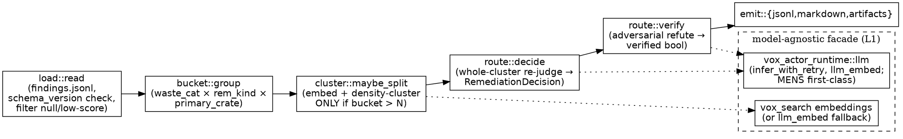

# Effort Route (S2) — design

## 0. Slice context

Slice 2 of the 4-slice Effort Audit program. S1 (`vox-effort-audit`, PR #95) ships the evidence layer: per-commit AI-judged findings. S2 turns that evidence into **routed, verified recommendations with drafted enforcement artifacts**.

| Slice | What it does | Status |
|---|---|---|
| S1 | Ingest git → per-commit AI judge → `findings.jsonl` + report. | Merged-pending (PR #95) |
| **S2 (this doc)** | Group findings → re-judge cluster + adversarially verify → `recommendations.jsonl` + staging-dir draft artifacts. CLI: `vox audit effort-route`. | This spec |
| S3 | Complete hybrid cost signal (billing exports + `vox.script.*` telemetry). | Deferred |
| S4 | Auto-emit: open draft PRs / GitHub issues from `recommendations.jsonl`; move staging artifacts into place. | Deferred |

**Dependency:** S2 consumes S1's `findings.jsonl` as a versioned file contract (`schema_version = "1.0"`). S2 does **not** re-walk git for judging — it re-reads specific commit diffs only to give the cluster re-judge richer context. S2 must land after S1 merges to `main` (or rebase onto it).

## 1. Purpose & non-goals

**`vox-effort-route`** reads S1 findings, groups them by the structural fix that would prevent them, re-judges each group with a fresh whole-cluster LLM pass plus an adversarial refutation pass, and emits:
- `recommendations.jsonl` — one row per verified cluster (the contract S4 consumes)
- `recommendations.md` — human-readable, ranked by total prevented cost
- Draft enforcement artifacts in a staging dir — concrete, reviewable proposals

The novel contribution (per the May 2026 prior-art scan in S1 §13): no existing tool routes audit findings to the *cheapest enforceable artifact* the authoring model can actually produce. S2 is that router.

### In scope (S2)
- Load + validate `findings.jsonl`; filter null/low-score findings.
- Deterministic bucketing by `(waste_category, remediation_kind, primary_crate)`.
- Conditional embedding sub-cluster for oversized buckets only.
- Per-cluster re-judge (one authoritative `RemediationDecision`) through the model-agnostic facade.
- Per-decision adversarial verify (one refutation pass).
- Draft artifacts in the codebase's real enforcement forms (see §5). Vox preferred, not required.
- `recommendations.jsonl` + `recommendations.md` + staging-dir artifacts.
- CLI `vox audit effort-route` under the unified `vox audit` umbrella.

### Out of scope (deferred)
- Opening PRs / GitHub issues; moving artifacts into the tree (S4).
- Billing-cost signal (S3).
- A dashboard.
- Editing S1's frozen `findings.jsonl` schema. S2 only reads it.

### Non-goals (never)
- **Not surveillance.** Recommendations describe systemic patterns and prevention, never people. `recommendations.md` and `recommendations.jsonl` carry no author identity (S1 already hashes author email; S2 never reads that field).
- **Not auto-merge.** S2 writes proposals to a staging dir, never into the build tree. A generated detector is a `.proposed` file outside compilation — never a hollow in-tree function (honors `feedback_no_stubs.md`).

## 2. Architecture

### 2.1 New crate

`crates/vox-effort-route/` — new L3 crate (it drives the `vox-actor-runtime` L3 LLM runtime, so it is a heavy-runtime consumer like `vox-search`/`vox-tensor`, not an L2 pure-data library).

| Property | Value |
|---|---|
| Layer | L3 (heavy-runtime consumer; depends on `vox-actor-runtime` L3) |
| `max_loc` | 4,000 |
| Fan-in | `vox-cli` (subcommand), `vox-audit` (umbrella, future) |
| Deps | `vox-effort-audit` (read-only: shared schema types), `vox-actor-runtime` (LLM **and** embedding facade — `llm_embed`), `vox-config`, `vox-telemetry`, `gix` (re-read diffs for cluster context), `serde`, `serde_json`, `chrono`, `uuid` (v4), `tracing`, `tokio`, `futures`, `thiserror` |
| **Not** a dep | `vox-search` — its `EmbeddingService` is `VoxDb`-coupled (persists vectors to a DB). S2 clusters in-memory and does not persist, so it calls `vox_actor_runtime::llm::llm_embed` directly (the same primitive `EmbeddingService` wraps). Dropping `vox-search` keeps the dep graph minimal. |
| Forbidden deps | `vox-orchestrator` (model selection reached via the same facade S1 uses, not a direct dep), UI crates |
| `staleness_exempt` | `false` |

Module layout:
```
crates/vox-effort-route/
├── Cargo.toml
├── README.md
└── src/
    ├── lib.rs
    ├── config.rs           -- EffortRouteConfig (TOML + CLI merge)
    ├── load.rs             -- parse + schema_version-validate findings.jsonl; filter
    ├── bucket.rs           -- deterministic group key; primary_crate derivation
    ├── cluster.rs          -- conditional embedding sub-cluster for oversized buckets
    ├── route/
    │   ├── mod.rs          -- Router trait; RemediationDecision; ArtifactForm
    │   ├── decide.rs       -- whole-cluster re-judge call
    │   ├── verify.rs       -- adversarial refutation call
    │   └── prompt.rs       -- decide + refute prompt templates + system prompts
    ├── emit/
    │   ├── jsonl.rs        -- recommendations.jsonl writer
    │   ├── markdown.rs     -- recommendations.md renderer
    │   └── artifacts.rs    -- staging-dir draft-artifact writer (.proposed forms)
    └── pipeline.rs         -- run(): load → bucket → cluster → decide → verify → emit
```

`vox-cli` gains one file: `crates/vox-cli/src/commands/audit_route.rs` (~150 LoC), wired under the existing `audit` subcommand alongside `effort`.

### 2.2 Layer placement
L3. Depends on the `vox-actor-runtime` L3 LLM facade plus L1 utilities (`vox-config`, `vox-telemetry`) and on `vox-effort-audit` (sibling L3, read-only type reuse). Because it consumes a heavy L3 runtime it is itself L3 — matching every other actor-runtime consumer (`vox-search`, `vox-tensor`, `vox-dei-shim`); an L2 classification would be a layer inversion. Consumed only by L5 surfaces. `layers.toml` row + `where-things-live.md` row land in the same PR (§10). (Note: `vox-search` is **not** a dependency — see §2.1.)

### 2.3 Shared types

S2 reuses S1's `WasteCategory`, `RemediationKind`, `FindingRow`, `ShapeFeatures`, `JudgeFinding` by depending on `vox-effort-audit` and importing them. **No shared-types crate extraction in S2** — deferred until a 3rd consumer (S3/S4) needs them, at which point `vox-effort-audit-types` (L1) is the clean move. (Optional: a one-line TODO marker in S1's `judge/schema.rs` noting the future extraction point — only if touching S1 files on this branch is acceptable; otherwise the note lives here.)

### 2.4 Diagram



## 3. Pipeline / data flow

1. **Load** (`load::read`). Parse `findings.jsonl` line-by-line. Validate each row's `schema_version == "1.0"`; on mismatch, abort with `LoadError::SchemaMismatch { found }` (loud failure, not silent skip). Drop rows where `finding` is `None` (Failed/Skipped commits) or `finding.waste_score < cfg.min_waste_score` (default 4). Carry forward `commit_sha`, `shape`, `cost`, `finding`.

2. **Bucket** (`bucket::group`). Deterministic key = `BucketKey { waste_category, remediation_kind, primary_crate }`.
   - `primary_crate` = the crate owning the plurality of the finding's touched paths. Derived from `finding.evidence_pointers` (file paths) and the commit's first-touched file; mapped to a crate by walking up to the nearest `crates/<name>/` segment, else `"<workspace-root>"`.
   - Findings with identical keys join the same bucket. This is pure, testable, free.

3. **Sub-cluster** (`cluster::maybe_split`). Only buckets with `member_count > cfg.max_bucket_size` (default 20) are split:
   - Embed each member's `finding.rationale_one_line` (+ optionally its `message_first_line`) via `vox_actor_runtime::llm::llm_embed` (direct facade call; no DB).
   - Density-cluster the embeddings (simple agglomerative or DBSCAN-style; no heavy dep — a small in-crate implementation over cosine distance is sufficient for ≤ a few hundred vectors). Produce sub-buckets.
   - Buckets at or below the threshold pass through untouched. **No embedding cost for the common case.**

4. **Decide** (`route::decide`). One LLM call per (sub-)bucket through the facade (`CodeEffortJudge` task category, reuse S1's model selection). The prompt includes: the bucket key, every member commit's sha + message + rationale, and — for up to `cfg.max_context_commits` members — the actual diff re-read via `gix`. Returns a `RemediationDecision` (§4).

5. **Verify** (`route::verify`). One independent LLM call per decision, prompted to *refute*: "Would the proposed fix actually have prevented these commits? Is the drafted artifact well-formed for its target surface? Answer refuted=true if uncertain." Decisions surviving (`refuted == false`) get `verified = true`. Refuted decisions are still emitted but flagged `verified = false` and sorted below verified ones.

6. **Emit** (`emit::*`). Stream `recommendations.jsonl`; render `recommendations.md`; write draft artifacts for verified decisions whose `artifact_form != None` into the staging dir. Emit `audit.route.*` telemetry.

## 4. `RemediationDecision` schema

The whole-cluster re-judge returns this (validated via structured output, same pattern as S1's `JudgeFinding`):

```jsonc
{
  "cluster_id": "01HW...-3",
  "bucket_key": {
    "waste_category": "MechanicalSweep",
    "remediation_kind": "ScriptAutomation",     // S1 hint (coarse)
    "primary_crate": "vox-config"
  },
  "member_commit_shas": ["a63d0c…", "…"],
  "member_count": 14,
  "total_member_tokens": 225600,                 // sum of member cost input+output tokens (Measured or Estimated); 0 for Unavailable/Ambiguous. USD computation deferred to S3, mirroring S1 leaving judge_total_estimated_usd=0.0.
  "artifact_form": "CiGate",                     // S2's finer-grained decision (§5)
  "confidence": 0.82,                            // 0..1 from the decide call
  "synthesized_fix_summary": "Add a CI gate asserting no inline timeout literals; 14 commits were manual sweeps onto vox_config::timeouts.",
  "drafted_artifact": {
    "form": "CiGate",
    "staging_path": "target/audit/effort-route/<run-id>/artifacts/no-inline-timeout-literals.ci.yaml.proposed",
    "body": "...full drafted artifact text...",
    "form_rationale": "Judge model is not Vox-capable; expressed as a CI contract entry rather than a .vox script.",
    "authoring_model_vox_capable": false
  },
  "verified": true,
  "refutation_note": "Refuter agreed the gate matches all 14 commits' diffs; no false-positive risk identified."
}
```

`recommendations.jsonl` rows carry `schema_version = "1.0"` (S2's own contract, independent of S1's). Enum casing is PascalCase, matching S1.

## 5. Artifact forms (the §4 correction)

**The drafted fix takes whatever enforcement form this codebase actually uses — it is NOT forced into Vox.** S1's `RemediationKind` (frozen at `schema_version 1.0`) is a coarse *hint*. S2 introduces its own richer `ArtifactForm` enum, and the re-judge step picks the **cheapest enforceable form the authoring model can actually produce**:

| `ArtifactForm` | Drafted as (staging file) | Authoring constraint |
|---|---|---|
| `AgentsMdRule` | markdown prose snippet → `*.agents-rule.md.proposed` | any model |
| `CodeAuditDetector` | a **rule specification** (pattern, severity, message, rationale) → `*.detector.md.proposed`; optional `.rs.proposed` skeleton when the model is confident | any model writes the spec; Rust skeleton best-effort |
| `ArchRule` | proposed `layers.toml` row or `vox-arch-check` rule → `*.arch-rule.toml.proposed` | any model |
| `CiGate` | proposed `contracts/ci/*.yaml` entry, **or a test/example fixture that *is* the enforcement** → `*.ci.yaml.proposed` / `*.example.proposed` | any model |
| `VoxScript` | `.vox.proposed` automation script | **only when `authoring_model_vox_capable == true` (MENS-strong)** |
| `CorpusNegativeExample` | MENS negative-example line → `*.corpus.jsonl.proposed` | any model |
| `None` | recommendation text only, no file | — |

**Vox-capability gate.** Before the decide pass, the pipeline needs to know whether the selected judge model is Vox-capable. To keep `vox-effort-route` free of a `vox-orchestrator` dependency (forbidden, §2.1), **the CLI layer (`vox-cli`) resolves both the model id and its Vox-capability and passes them into `vox_effort_route::run` as parameters** — exactly the pattern S1's F1 used to resolve the judge model in `vox-cli` rather than inside the audit crate. The capability is `ModelCapabilities.writes_vox` on the registry entry **OR** the operator allowlist — implemented as `resolve_vox_capability(model_id, allowlist) = registry.get(model_id).writes_vox || allowlist.contains(model_id)`. `writes_vox` is a registry-authoring `bool` defaulting `false`, seeded `true` only at the three MENS seed sites (local `MensCatalog`, the `PopuliMeshCatalog` mesh seed, and the duplicated inline mesh-peer push in `registry.rs`); it is *not* added to the `Capability`/`merge_capability_flags` OR-merge so an OpenRouter advertisement cannot clobber the seeded value. The `[audit.route] vox_capable_models` allowlist remains as an operator OVERRIDE layered on top, not the sole source. A model unknown to the offline registry and absent from the allowlist is non-Vox-capable (safe default). If not Vox-capable, `VoxScript` is removed from the allowed `ArtifactForm` set for that run, and the decide prompt instructs the model to choose the next-cheapest enforceable form. The decision records `authoring_model_vox_capable` and a `form_rationale`. This means: dogfooding with MENS can produce real `.vox` automation; running with an external frontier judge produces CI rules / lint specs / prose / corpus examples instead — all enforceable in this repo.

**Why `.proposed` extensions.** Every staging artifact carries a `.proposed` suffix so it is invisible to the build, the test runner, and `vox-arch-check`. A generated detector is never a hollow in-tree function; it is a reviewable text proposal a human (or S4) promotes deliberately.

## 6. Configuration

New `vox.toml` section:
```toml
[audit.route]
min_waste_score = 4
max_bucket_size = 20            # buckets larger than this get embedding sub-cluster
max_context_commits = 6        # diffs re-read per cluster for the decide prompt
staging_dir = "target/audit/effort-route"

[audit.route.judge]
model_preference = "mens-r6.2" # optional; else registry selection for CodeEffortJudge
max_total_tokens = 5_000_000
max_dollar_cost = 5.00
verify = true                  # adversarial refutation pass (default on)
```
Resolution: CLI flags > `[audit.route.*]` > `EffortRouteConfig::default()`.

## 7. Error handling

`EffortRouteError`:
- `LoadFailed(io)` / `SchemaMismatch { found }` — fatal at startup.
- `DecideFailed { cluster_id, source }` — recorded on the decision (`verified=false`, `confidence=0`), pipeline continues. If > 25% of clusters fail decide, exit non-zero.
- `VerifyFailed { cluster_id }` — decision kept but `verified=false`; not fatal.
- `EmbeddingFailed` — fall back to NOT sub-clustering that bucket (treat as one cluster); `warn!` + continue.
- `BudgetExhausted` — remaining clusters emitted as `artifact_form=None`, `verified=false`; exit 0 with a report warning.
- `ArtifactWriteFailed(io)` — fatal.

## 8. Testing

Test-first per AGENTS.md. Highlights:
- `load`: fixture `findings.jsonl` (good, schema-mismatch, null-finding, low-score) → expected filtered set; schema-mismatch aborts.
- `bucket`: deterministic key tests; `primary_crate` derivation across path shapes (crate path, workspace-root file, multi-crate commit picks plurality).
- `cluster`: below-threshold bucket passes through unchanged (asserts **no embed call** via a counting `MockEmbedder`); above-threshold splits; embedding-failure falls back to single cluster.
- `route` with a `MockRouter`: deterministic decisions; Vox-capability gate removes `VoxScript` when `authoring_model_vox_capable=false`; verify refutation flips `verified`.
- `emit::artifacts`: every staged file ends in `.proposed`; asserts **nothing written outside the staging dir** (no in-tree writes); `None` form writes no file.
- `emit::markdown`: insta snapshot; author-leak guard (no `@`, no 64-hex).
- e2e `pipeline::run` against a fixture `findings.jsonl` with `MockRouter` + `MockEmbedder`: asserts `recommendations.jsonl`, `recommendations.md`, staging artifacts exist; budget exhaustion path.
- `llm_provider_call` detector clean across the crate.
- Coverage floor: start at 70% in `.config/coverage-gates.toml`; the `MockRouter`/`MockEmbedder` cover the LLM/embedding branches (mirrors S1's measured 92%). Lower only if first measurement is below 70.

## 9. Model-agnostic & cost

All inference + embedding through the facade; MENS first-class for decide, verify, and embed. Vox-capability is a model-registry capability flag, NOT a hardcoded model check — a future Vox-capable non-MENS model inherits `VoxScript` eligibility by registering the capability. Budget ceiling like S1 (default 5M tokens / $5). Cost ≈ `clusters × 2 calls` (decide + verify) + `oversized_buckets × embed`; a 30-day run with tens of clusters stays well under the ceiling.

## 10. AGENTS.md / arch additions (same PR)

- `layers.toml`: `vox-effort-route = { layer = 2, kind = "library", max_loc = 4000 }`.
- `where-things-live.md`: row — "Routing audit findings to enforcement artifacts → `crates/vox-effort-route/`".
- AGENTS.md `vox audit` umbrella section: add `vox audit effort-route` to the subcommand list.
- README for the crate.

## 11. Hooks for S4

- `recommendations.jsonl` (`schema_version="1.0"`) is the contract S4 reads to open PRs/issues.
- Staging artifacts are already files; S4 moves them into place + opens a PR (the `staging_path` and `form` fields tell it where each belongs).
- `Router` and `Embedder` are traits with Mock impls — S4 reuses them for dry-run.
- No GitHub coupling in S2.

## 12. Acceptance criteria

1. `vox audit effort-route --findings <path>` produces `recommendations.jsonl`, `recommendations.md`, and staging artifacts under `<staging_dir>/<run-id>/`.
2. Buckets ≤ threshold incur zero embedding calls (asserted via mock).
3. Vox-capability gate: with a non-Vox-capable judge, no `VoxScript` artifacts are produced; with a MENS-tagged judge, `.vox.proposed` is allowed.
4. Every staging artifact ends in `.proposed`; nothing is written into the build tree.
5. `recommendations.md` contains no author identity.
6. `cargo test -p vox-effort-route` passes ≥ 70% coverage with mocks.
7. `vox-arch-check` clean; `llm_provider_call` detector clean.
8. Manual run against S1's own `findings.jsonl` (generated from this repo) yields at least one verified recommendation whose drafted artifact is well-formed for its target surface.

## 13. Risk register

| # | Risk | L | S | Mitigation |
|--:|---|:-:|:-:|---|
| 1 | External judge can't write Vox → useless `.vox` stubs | M | H | §5 Vox-capability gate removes `VoxScript` unless model is Vox-capable; falls back to CI/lint/prose forms |
| 2 | Embedding cost/latency on every run | L | M | §3 step 3 conditional — embed only oversized buckets |
| 3 | Re-judge overrides correct S1 tags wrongly | M | M | §3 step 5 adversarial verify; low-confidence/refuted decisions flagged, not silently trusted |
| 4 | Generated detector lands as a hollow in-tree fn | L | H | §5 `.proposed` staging-only; §8 test asserts no in-tree writes |
| 5 | S1 schema bump silently mis-parsed | L | M | §3 step 1 `SchemaMismatch` hard abort |
| 6 | Recommendations used to blame contributors | L | H | §1 non-goals; no author identity in any S2 output |
| 7 | Budget runaway from 2 calls/cluster | M | M | §6 budget ceiling; remaining clusters degrade to `None` form |

## 14. Open questions (resolved before plan-writing)

- **Q1.** Density-cluster algorithm — hand-rolled agglomerative vs. a small crate? **Tentative:** hand-rolled cosine-distance agglomerative (≤ few hundred vectors; no new dep). Revisit if volumes grow.
- **Q2.** Should `primary_crate` use S1's `shape.file_extension_histogram` or re-derive from evidence pointers? **Tentative:** evidence pointers first (more precise), histogram as fallback.
- **Q3.** Where does the Vox-capability flag live on the registry entry? **Resolved (2026-05-30):** a `ModelCapabilities.writes_vox: bool` field with a bare `#[serde(default)]` (default false; seeded true at the three MENS seed sites). The config allowlist is retained not as a fallback but as an operator OVERRIDE: `resolve_vox_capability` returns `registry.writes_vox || allowlist.contains(model_id)`. `writes_vox` is deliberately kept out of the `Capability` enum / `merge_capability_flags` so the OpenRouter OR-merge cannot clobber the seeded MENS value.

These are author-resolvable during planning; none block writing the plan.
